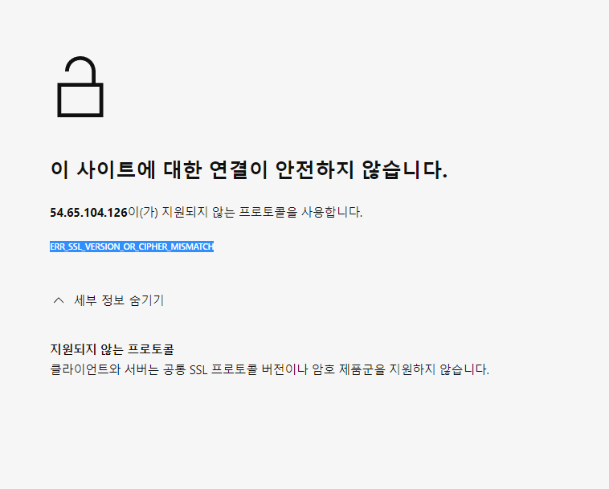

# django in aws

*배포할 django project 이름을 mysite로 가정*

`scp -i key -r mysite ubuntu@ip:/home/ubuntu/mysite`


```terminal
# anaconda 가상환경과 python 가상환경 중 하나 선택해서 사용 (anaconda 사용이 더 편함)
# 가상환경 이름을 mysite로 가정

# anaconda venv
conda create -n mysite python=3.7 django
conda activate mysite

## python venv
# sudo apt install python3-venv -y
# mkdir venv
# cd venv
# python3 -m venv mysite
# cd mysite/bin
## .과 activate 사이 공백
# . activate

cd ~

```


**django 설정**

```terminal
cd mysite
python manage.py migrate

# config directory로 이동
vim settings.py

# aws ip 넣어주기
# 13.114.200.183 이 ip라면,
ALLOWED_HOSTS = ['13.114.200.183']

```


---

*두가지 방법 중 하나 선택*


**1. django 만으로 실행**

```terminal
cd ~/mysite

# nohup : terminal 연결이 끊어져도 계속 실행
# & : background 실행
nohup python manage.py runserver 0:8000 &

# 종료방법 : ps 명령으로 python pid 확인 후 kill (pid는 실행 때 마다 바뀜)
ps
kill 8564

# 서버 로그 확인 방법
cat nohup.out

```


---


**web server와 분리 후 실행**

```terminal
# config directory로 이동
vim settings.py
# True -> False
DEBUG=False

```

우리꺼

```
DEBUG =False

ALLOWED_HOSTS = ['35.77.242.184']

STATIC_URL = 'static/'
STATICFILES_DIRS = [BASE_DIR/'static']

```


*gunicorn 설정*

`pip install gunicorn`


`vim mysite.env` 만들기 

```terminal
DJANGO_SETTINGS_MODULE=config.settings.prod
```

우리꺼

team/team3 에서 

```
DJANGO_SETTINGS_MODULE=team3.settings
```

# nginx 에러확인

nginx 에러확인

```terminal
sudo nginx -t -c /etc/nginx/nginx.conf

sudo service nginx restart # 재시작
```

uwsgi

```terminal
sudo service uwsgi start
sudo service nginx start
두 명령어로 두개의 소프트웨어를 데몬으로 작동시킵니다.

sudo service uwsgi status
sudo service nginx status
정상 작동시 반응
```


# 다시 설정


`vim /etc/systemd/system/mysite.service`

```terminal
[Unit]
Description=gunicorn daemon
After=network.target

[Service]
User=ubuntu
Group=ubuntu
WorkingDirectory=/home/ubuntu/Fishing/fish
ExecStart=/home/ubuntu/anaconda3/envs/Fish/bin/gunicorn \
--workers 2 \
--bind unix:/tmp/gunicorn.sock \
fish.wsgi:application

[Install]
WantedBy=multi-user.target

```

우리꺼

```terminal
[Unit]
Description=gunicorn daemon
After=network.target

[Service]
User=ubuntu
Group=ubuntu
WorkingDirectory=/home/ubuntu/DI/team3
ExecStart=/home/ubuntu/anaconda3/envs/mysite/bin/gunicorn \
--workers 2 \
--bind unix:/tmp/gunicorn.sock \
team3.wsgi:application

[Install]
WantedBy=multi-user.target
```


```terminal
# 서비스 시작
sudo systemctl start mysite.service
# 서비스 확인
sudo systemctl status mysite.service
```

디렉토리를 찾지 못한다고함 

홈에서 which gunicorn 을 해서 해당 경로를 `ExecStart` 에 넣어줌 


*nginx 설정*

```terminal
sudo apt install nginx -y
cd /etc/nginx/sites-available
```


`sudo vim mysite`

```terminal
server {
	listen 8083;
	server_name 54.65.104.126;
	
	location /static {
		alias /home/ubuntu/Fishing/fish/static;
	}

	location / {
		include proxy_params;
		proxy_pass http://unix:/tmp/gunicorn.sock;
	}
}
```


우리꺼 

```
server {
        listen 8083;
        server_name 35.77.242.184;

        location /static{
                alias /home/ubuntu/DI/team3/static;
        }

        location / {
                include proxy_params;
                proxy_pass http://unix:/tmp/gunicorn.sock;
        }
}

```


```terminal
cd /etc/nginx/sites-enabled
sudo rm default
sudo ln -s /etc/nginx/sites-available/mysite

# nginx 재시작
sudo systemctl restart nginx

# 13.114.200.183 접속해보기! 우리 ip
```

`main process exited, code=exited, status=1/failure`

`nginx service failed with result: exit-code`

에러 발생시에는  sudo vim Fish 에서 포트번호 8083 으로 바꿔줌 http안되고 tcp포트로 해야함

명령어는 ubuntu@ip:~/Fishing/fish$ 에서 gunicorn fish.wsgi:application --preload -b 0.0.0.0:8083

에서 서버접속

:


css 문제 

- 경로 설정 문제인데 
- collectstatic


# https

장고 aws 를 https 로 바꾸기 위한 과정 

[django-sslsesrver에서 nginx로 이전 및 보안 키 획득절차 · Issue #16 · kookmin-sw/2019-cap1-2019_3 (github.com)](https://github.com/kookmin-sw/2019-cap1-2019_3/issues/16)

해당 주소를 참고했다.

```terminal
upstream django {
       server 54.65.104.126:443;

}


server {
#       listen 8083;
        listen 443 ;
       server_name 54.65.104.126;


        charset utf-8;

       ssl on;
       ssl_certificate     /etc/nginx/ssl/django.crt;
       ssl_certificate_key /etc/nginx/ssl/django.key;

       ssl_session_timeout 500m;

       ssl_protocols SSLv2 SSLv3 TLSv1;
       ssl_ciphers             ALL:!ADH:!EXPORT56:RC4+RSA:+HIGH:+MEDIUM:+LOW:+SSLv2:+EXP;
       ssl_prefer_server_ciphers       on;


        location /static {
                alias /home/ubuntu/Fishing/fish/static;
        }

        location / {
                include proxy_params;
                proxy_pass http://unix:/tmp/gunicorn.sock;
#               Host $host;
#               proxy_set_header X-Forwarded-For $proxy_add_x_forwarded_for;
#               proxy_set_header X-Forwarded-Proto $scheme;
#               return 301 https://$host$request_uri;
        }
        # add
#       location / {
#               uwsgi_pass django;
#               include /home/ubuntu/Fishing/fish/uwsgi_params;
#       }

}
```

위 방법으로 해보았지만 아쉽게도 

https://



같은 화면이 나왔다 아마 https가 되긴했는데 인증서와 보안 프로토콜 문제 인거 같아서


domain을 구입하고 certbot을 사용해서 인증서를 받아볼려고 한다 아래 설정은 다시 바꿔주었다.

```terminal
#upstream django {
#       server 54.65.104.126:443;

#}


server {
        listen 80;
        server_name nunukang.shop;
        charset uft-8;

        location / {
                return 301 https://$host$request_uri;
        }

}


server {
#       listen 8083;
        listen 443 ssl http2;
#       server_name 54.65.104.126;
        server_name nunukang.shop;

        charset utf-8;

#       ssl on;
#       ssl_certificate     /etc/nginx/ssl/django.crt;
#       ssl_certificate_key /etc/nginx/ssl/django.key;

#       ssl_session_timeout 500m;

#       ssl_protocols SSLv2 SSLv3 TLSv1;
#       ssl_ciphers             ALL:!ADH:!EXPORT56:RC4+RSA:+HIGH:+MEDIUM:+LOW:+SSLv2:+EXP;
#       ssl_prefer_server_ciphers       on;


        location /static {
                alias /home/ubuntu/Fishing/fish/static;
        }

        location / {
                include proxy_params;
                proxy_pass http://unix:/tmp/gunicorn.sock;
#               Host $host;
#               proxy_set_header X-Forwarded-For $proxy_add_x_forwarded_for;
#               proxy_set_header X-Forwarded-Proto $scheme;
#               return 301 https://$host$request_uri;
        }
        # add
#       location / {
#               uwsgi_pass django;
#               include /home/ubuntu/Fishing/fish/uwsgi_params;
#       }

}
```


```
#upstream django {
#       server 54.65.104.126:443;

#}


server {
    if ($host = nunukang.shop) {
        return 301 https://$host$request_uri;
    } # managed by Certbot


        listen 80;
        server_name nunukang.shop;
        charset uft-8;

        location / {
                return 301 https://$host$request_uri;
        }


}
server {
        listen 443 ssl http2;
#       server_name 54.65.104.126;
        server_name nunukang.shop;

        charset utf-8;

#       ssl on;
#       ssl_certificate     /etc/nginx/ssl/django.crt;
#       ssl_certificate_key /etc/nginx/ssl/django.key;

#       ssl_session_timeout 500m;

#       ssl_protocols SSLv2 SSLv3 TLSv1;
#       ssl_ciphers             ALL:!ADH:!EXPORT56:RC4+RSA:+HIGH:+MEDIUM:+LOW:+SSLv2:+EXP;
#       ssl_prefer_server_ciphers       on;


        location /static {
                alias /home/ubuntu/Fishing/fish/static;
        }

        location /webhdfs {
                proxy_pass http://54.65.104.126:8903;
        }
        location /test/webhdfs {
                proxy_pass http://ip-172-31-41-91.ap-northeast-1.compute.internal:9864;
                proxy_connect_timeout 300;

                proxy_send_timeout 300;

                proxy_read_timeout 300;

                send_timeout 300;
        }

        location / {
                include proxy_params;
                proxy_pass http://unix:/tmp/gunicorn.sock;
#               Host $host;
#               proxy_set_header X-Forwarded-For $proxy_add_x_forwarded_for;
#               proxy_set_header X-Forwarded-Proto $scheme;
#               return 301 https://$host$request_uri;
        }
        ssl_certificate /etc/letsencrypt/live/nunukang.shop/fullchain.pem; # managed by Certbot
    ssl_certificate_key /etc/letsencrypt/live/nunukang.shop/privkey.pem; # managed by Certbot
}
        
        
        

```


# pip 들

`pip install django-auth`

`pip install apache-airflow`

`pip install kafka-python`

aws 배포를위한 nginx 구니콘 

`sudo apt install net-tools`  // netstat 다운

`pip install Image`

# 소셜_구글 로그인

`pip install django-auth`


중간에 

`python manage.py migrate  `

테이블 만드는거 있음


```mysql
mysql 
(1366, "Incorrect string value: '\\xEC\\x9E\\xAC\\xEC\\x9B\\x90' for column 'first_name' at row 1") 
에러 해결
mysql 접속후 use db
mysql> show variables like 'c%';
이후 해당 에러가난 테이블 혹은 데이터베이스를 
alter table auth_user convert to character set utf8;
하여 latin1을 utf8로 바꾸어줌 
```


