# VM_*Ubuntu*

리눅스 기반의 os

`하둡,스파크,재플린 노트북`을 CLI로 다운,연결 및 이용

여기서 사용하는 기본 리눅스 명령어 정리는 linux.txt파일에 있음


[Hadoop](#Hadoop  3.3.1)

[Spark](#Spark  3.1.3)

[Spark_문법](#Spark 문법)


전체 역할에서
하둡은 저장과 연결
스파크는 DB에 넣어주기전 처리


# Hadoop  3.3.1

**대용량 데이터를 분산 저장할수 있는 자바기반 프로그램**

hdfs - 하둡 설정 

yarn - 리소스,노드관리 해주는 관리자


**싱글모드로 구현**

> 싱글모드는 한컴퓨터에 namenode,datanode가 있으며 서로 다른컴퓨터로 인식해 정보를 저장하게한다.


Secondary NameNode:  namenode 죽었을때 임시로 namenode가 되주는얘


`sudo apt install openssh-server ssh-askpass -y`

SSH(Secure Shell) 원격지 호스트 컴퓨터에 접속하기 위해 사용되는 인터넷 프로토콜

위 명령어는 ssh 서버를 열어서 별도의 물음 없이 접속허가를 내려주는 모듈이다


#ssh-keygen
namenode와 datanode는 서로를 다른컴퓨터로 인식
서로 접속시 특정키가 있으면 바로바로 접속가능 그게 ssh-keygen 임


-P '' 이전키 일단 아무것도 없는걸로 덮어씌기

`ssh-keygen -t rsa -P '' -f ~/.ssh/id_rsa`

열쇠만듬

ssh-keygen 시큐어셀 접속 

키는 rsa 타입 ~/.ssh/id_rsa여기에 키만듬

`cat ~/.ssh/id_rsa.pub >> ~/.ssh/authorized_keys`

> rsa:비대칭형의 공개키 암호방식
> des: 대칭키

(cat)명령 >> 파일 파일에 추가저장

id_rsa.pub만들어진 public키를 /.ssh/authorized_keys넣어줌

하둡이 자바기반  프레임 워크이기 때문에 

자바 in ubuntu 

>openjdk
>amazon corretto

위 2개중에서 amazon corretto를 다운

wget CLI에서 해당링크 연결된 무언가 응답받기 가능 브라우저비슷 

```linux
wget https://corretto.aws/downloads/latest/amazon-corretto-11-x64-linux-jdk.tar.gz
```


`tar -xvzf amazon-corretto-11-x64-linux-jdk.tar.gz`    # 압축해제

`ln -s amazon-corretto-11.0.14.10.1-linux-x64/ java`  # java라는 심볼링 링크 만들어줌 

ls -al

lrwxrwxrwx  1 jaewon jaewon        39 Mar 10 23:06 java -> amazon-corretto-11.0.14.10.1-linux-x64/

심볼링크 확인가능


`sudo vim ~/.bashrc `  # 자바 변수및 경로설정

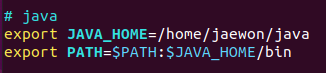

`source ~/.bashrc`      # bash.rc 저장 실행


**하둡과 스파크 사용을 위해 3.8인 파이썬 버전을 낮춰야함**

python3 --version  버전내려야함

`sudo add-apt-repository ppa:deadsnakes/ppa`  // 3.7버전을 설치하기위한 공간추가
`sudo apt update`


sudo vim ~/.bashrc

`sudo apt install python3.7 -y`    3.7버전 다운

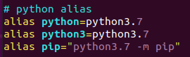

파이썬 & pip 별칭설정 앞으로 python,python3,pip명령어 들은 = 이후의 값을가지게됨

source ~/.bashrc

``` 
wget https://dlcdn.apache.org/hadoop/common/hadoop-3.3.1/hadoop-3.3.1.tar.gz
```

`tar -xvzf hadoop-3.3.1.tar.gz`

압축해제

`ln -s hadoop-3.3.1 hadoop`

가끔 심볼릭링크 깨질수있음
삭제하고 다시

`sudo vim ~/.bashrc`

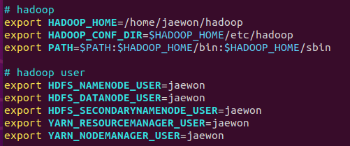

바로 저장실행
`source ~/.bashrc`


`cd $HADOOP_CONF_DIR` 이후

`vim hadoop-env.sh `  하둡 환경  # 주석표시 풀고 추가 설정 해줌 들어가서 확인

54번줄

```
export JAVA_HOME=/home/jaewon/java
```


58번줄

```
export HADOOP_HOME=/home/jaewon/hadoop
```


68번줄

```
export HADOOP_CONF_DIR=${HADOOP_HOME}/etc/hadoop
```


97번줄

```
export HADOOP_OS_TYPE=${HADOOP_OS_TYPE:-$(uname -s)}
```


198번줄에도 하나 tmp파일 어디에 저장?
임시저장소 가상머신 종료 시 하둡저장 파일 다 날라감

``` 
export HADOOP_PID_DIR=$HADOOP_HOME/pids
```


그뒤 `cd $HADOOP_CONF_DIR`  경로에서 중요 설정 해줌 

`vim core-site.xml`

```html
<configuration>
        <property>
                <name>fs.defaultFS</name>
                <value>hdfs://localhost:9000</value>
        </property>
</configuration>
```

`vim hdfs-site.xml `

```html
<configuration>
        <property>
                <name>dfs.replication</name>
                <value>1</value>
        </property>
        <property>
                <name>dfs.namenode.name.dir</name>
                <value>/home/jaewon/hadoop/namenode_dir</value>
        </property>
        <property>
                <name>dfs.datanode.data.dir</name>
                <value>/home/jaewon/hadoop/datanode_dir</value>
        </property>
</configuration>
```

`vim mapred-site.xml`   # 맵리듀스 관련 설정

```html
<configuration>
        <property>
                <name>mapreduce.framework.name</name>
                <value>yarn</value>
        </property>
</configuration>
```


cat core-site.xml   기본적인 하둡 설정

cat hdfs-site.xml   싱글모드/데이터,네임노드를 컴퓨터 하나가 다함 ,네임하나에 데이터 여러개/멀티모드 

똑같은거 데이터 노드에 복사되야하는데 싱글모드라 안그래도됨 요청되었을때 저장 몇개? value에 1로 되어있음 
cat mapred-site.xml

프레임워크 얀모드로 설정

hdfs namenode -format   # 네임노드 초기화

hdfs datanode -format  	# 데이터 모드 초기화

포맷해야 사용가능 처음 설정 이후만


yarn 작업및 리소스관리   // 리소스 매니저 

2.0버전부터 도입 jobtrack를 분리 맵리듀스 하기 위해 필요한 애들을 자름 

분산모드

https://hadoop.apache.org/docs/current/hadoop-project-dist/hadoop-common/ClusterSetup.html
Cluster Setup

start-dfs.sh

start-yarn.sh

jps

stop-all.sh


`hdfs dfsadmin -report`   # 설정한 하둡 관련 설정  vm내부 브라우저 url에서 확인가능

```
localhost:9870    (vm안에서) 내가 설정한 하둡 브라우저로 확인가능  hdfs

localhost:8088    하둡 yarn이랑 관련된 페이지 // 스파크 실행시 스파크 확인가능 
```


# Spark  3.1.3

데이터 가공,처리하는 프레임워크

스파크 : 빅데이터 처리를 위한 오픈소스 분석엔진


rdd
df 
ds  는 파이썬 지원안됨


bin 은 실행파일

sbin은 sudo가 실행하는 파일


하둡 사용가능유저 설정

HDFS 하둡 분산피일 시스템 


**설정에서 path오류로 다 날라갔을때**

```
cd /etc/environment.d/

export PATH=$PATH:/usr/bin:/bin

cd

ls

~ 에서 입력

PATH=/usr/local/sbin:/usr/local/bin:/usr/sbin:/usr/bin:/sbin:/bin:/usr/games:/usr/local/games:/snap/bin:/home/jaewon/java/bin:/home/jaewon/java/bin:/home/jaewon/hadoop/bin:/home/jaewon/hadoop/sbin
```


스파크 설치

https://spark.apache.org/downloads.html

스파크 버전 3.1.3 

재플린 노트북 때문

하둡 따로 설치 버전

설치

```
wget https://dlcdn.apache.org/spark/spark-3.1.3/spark-3.1.3-bin-without-hadoop.tgz
```

만일을 대비해 하둡 중지 후 작업

하둡 중지

/# stop-all.sh

stop-dfs.sh
stop-yarn.sh

`tar -xvzf spark-3.1.3-bin-without-hadoop.tgz `  # 압축해제

`ln -s spark-3.1.3-bin-without-hadoop spark `  # 심볼링크

자바는 하둡에 필요해서 하둡이 자바 기반이라 받음


`sudo vim ~/.bashrc`  들어가서 스파크 설정

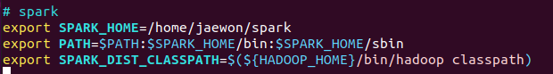

`source ~/.bashrc`


`cd $SPARK_HOME/conf`

개별 설정 파일 복사겸 이름 간소화

```
cp workers.template workers    			# 라이센스 등등
cp spark-env.sh.template spark-env.sh			# 설정
cp spark-defaults.conf.template spark-defaults.conf
```

해당 디렉토리에서

`vim spark-env.sh`

```scala
export JAVA_HOME=/home/jaewon/java
export HADOOP_CONF_DIR=/home/jaewon/hadoop/etc/hadoop
export YARN_CONF_DIR=/home/jaewon/hadoop/etc/hadoop
export SPARK_DIST_CLASSPATH=$(/home/jaewon/hadoop/bin/hadoop classpath)

export PYSPARK_PYTHON=/usr/bin/python3.7
export PYSPARK_DRIVER_PYTHON=/usr/bin/python3.7
```

`vim spark-defaults.conf`

```
spark.master                            yarn
```


이상으로 스파크 **싱글모드** 설치끝


## Spark 문법

스파크?

클라이언트 요청시 드라이버가 받아서 클러스터매니저에게 주면 슬레이브에 던져서 실행시킴

스파크는 기본적으로 scala(jvm 기반)

```
cd ~
jaewon@ubuntu:~$ start-dfs.sh
start-yarn.sh
pyspark      # 시작 
```

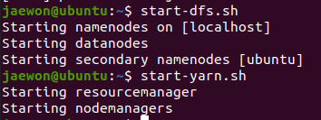

각노드 작동 확인


http://localhost:8088  에서 pyspark확인가능
--> 하둡 yarn이라는 놈이 spark를 도와줌 연결?


lazy-evaluation (lazy-execution)

게으른 진화 게으른 실행?

작업들을 다읽은 후에 진행

RDD 가 SERIES 판다스의 시리즈 같은 것 으로  특정 상황에서 장애 복구하기에 편하다
DataFrame 가 DataFrame 이다.

```python
rdd01 = sc.range(0,1000,1,2)
```

0~1000 ,1씩증가, 파티션을 2개로 나눔

rdd01    ~~~~~.scala 내부에선 스칼라로  사용  객체로 보여줌


```
rdd01.collect()     # 내용확인
```

파티션 확인

```    scala
rdd01.getNumPartitions()
```

2
아까 파티션 2개라고 해서 2임 

```python
rdd01.take(5)
[0, 1, 2, 3, 4]
```

```python
rdd02 = rdd01.filter(lambda x:x % 2)
rdd02 = rdd01.filter(lambda x:x % 2 == 1)
rdd01에서 0이 아닌애들만 rdd02로감   홀수만 남음
```

```python
rdd03 = rdd01.filter(lambda x:not x % 2)  짝
rdd03 = rdd01.filter(lambda x:x % 2 == 0)  짝
```

컨트롤 + l == cls

```python
countries = ['korea','united states america','united kingdom','japan','france','germany','italia','canada','korea']
-> rdd로 바꿔야 collect가 통함
```

```python
g8 = sc.parallelize(countries,2)  # countries를 2개의 파티션으로 분할
g8.collect()
g8.count()
g8 = g8.distinct()   	# w중복제거
g8.collect()
```

파이썬 map 함수 리터럴값에 함수 적용 

```python
g8_upper = g8.map(lambda x:x.upper())
g8_upper.collect()		# 중간중간 내용확인
g8_list01 = g8.map(lambda x: list(x))
g8_list01 .collect()
g8_list01 = g8.map(lambda x: list(x))  # 문자열 하나하나를 리스트 넘버로 인식해서 아래와 같										  은 결과가 나옴
>>> g8_list01.collect()
[['j', 'a', 'p', 'a', 'n'], ['f', 'r', 'a', 'n', 'c', 'e'], ['i', 't', 'a', 'l', 'i', 'a'], ['c', 'a', 'n', 'a', 'd', 'a'], ['g', 'e', 'r', 'm', 'a', 'n', 'y'], ['k', 'o', 'r', 'e', 'a'], ['u', 'n', 'i', 't', 'e', 'd', ' ', 's', 't', 'a', 't', 'e', 's', ' ', 'a', 'm', 'e', 'r', 'i', 'c', 'a'], ['u', 'n', 'i', 't', 'e', 'd', ' ', 'k', 'i', 'n', 'g', 'd', 'o', 'm']]
>>> g8_list02 = g8.flatMap(lambda x:list(x))
>>> g8_list02.collect()
['f', 'r', 'a', 'n', 'c', 'e', 'i', 't', 'a', 'l', 'i', 'a', 'c', 'a', 'n', 'a', 'd', 'a', 'j', 'a', 'p', 'a', 'n', 'k', 'o', 'r', 'e', 'a', 'u', 'n', 'i', 't', 'e', 'd', ' ', 's', 't', 'a', 't', 'e', 's', ' ', 'a', 'm', 'e', 'r', 'i', 'c', 'a', 'u', 'n', 'i', 't', 'e', 'd', ' ', 'k', 'i', 'n', 'g', 'd', 'o', 'm', 'g', 'e', 'r', 'm', 'a', 'n', 'y']
>>> counting = sc.range(1,9,1,2)
```

```python
g8_list02 = g8.flatMap(lambda x:list(x))    #  다쪼개서 하나의 리스트로 통합 
```

map과 flatmap의 차이 

map은 각각의 요소에 적용시킴

flatmap은 적용시키고 전체적인 요소로 따짐


zip 요소의 개수가 같은 리스트를 딕셔너리 형태로 합쳐줌

```python
counting = sc.range(1,9,1,2)
counting_g8 = counting.zip(g8)
counting_g8.collect()
# 단순 결과만 보기 원한다면 한번해 해도된다
counting.zip(g8).collect()
```

```python
score = [('강호동',10),('유재석',30),('강호동',30),('신동엽',70),('유재석',60)]
score_rdd = sc.parallelize(score,2)   # score를 2개의 파티션으로 나눔
score_rdd.collect()

# reduceByKey 
score_rdd_rbk = score_rdd.reduceByKey(lambda x,y:x+y)
score_rdd_rbk.collect()
[('강호동', 40), ('신동엽', 70), ('유재석', 90)]
```

여기서 reduceByKey와 groupByKey의 차이

내가 느낀  [차이](# 내가 느낀 groupByKey() ,reduceByKey() 차이점)

훨씬 큰 데이터 셋에서 `reduceByKey`와 `groupByKey`는 셔플링하는 데이터 차이가 극명합니다. `groupByKey` 대신 사용할 수 있는 다른 함수들도 존재합니다.

 `reduceByKey`는 키를 기준으로 셔플링을 하기 전에 미리 각 파티션 내에 있는 데이터들을 먼저 combine을 수행합니다. 맵리듀스의 combiner를 사용하는 것과 동일한 역학을 수행하는 것

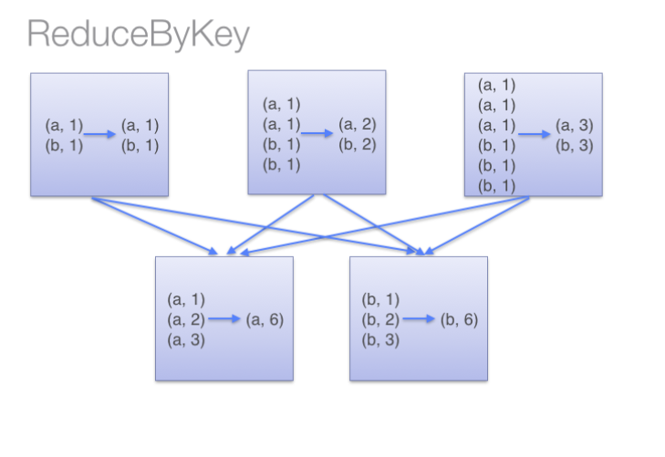

 `groupByKey`는 모든 키-값 페어에 대해 셔플을 수행합니다. 이러한 동작은 단어 세기 예제와 같은 경우 불필요한 셔플을 발생하여 네트워크 자원을 더 많이 소모함

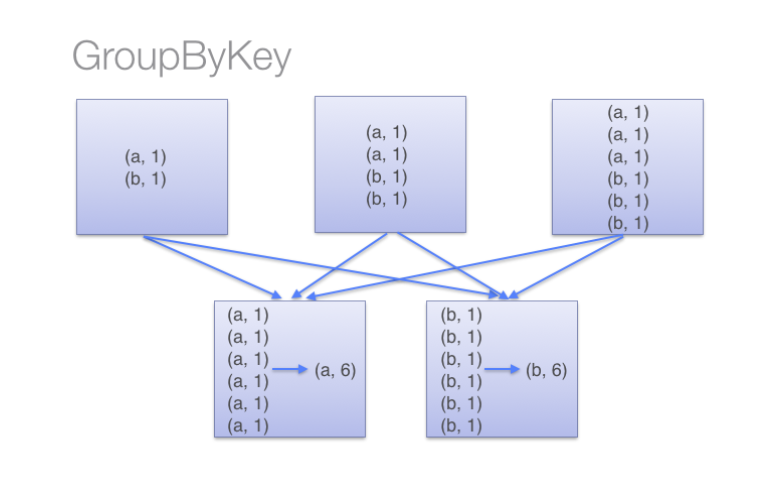


```python
nums = sc.parallelize([1,2,3,1,1,2,5,4],2)

# 두개의 결과다름
nums.sortBy(lambda x:x).collect()  # 정렬된 형태로 나옴
nums.collect()
```

```python
arrs = g8.glom()   # 파티션 별로 리스트로 나눠줌   ## 주의 크기가 크면 에러가 잘남 
arrs.collect()
[['japan', 'france', 'italia', 'canada'], ['germany', 'korea', 'united states america', 'united kingdom']]
```

`nums.stats()`

pd의 info같은 거 해당 데이터의 어지간한건 다 보여줌


```scala
g8.take(3)
['japan', 'france', 'italia']
g8.takeOrdered(3)			# 정렬다음에 가져옴 오름차순
['canada', 'france', 'germany']
g8.top(3)  			# 내림차순 정렬후 가져옴
['united states america', 'united kingdom', 'korea']
```

```java
# count()를 이용하여 함수사용
g8.takeOrdered(g8.count())
['canada', 'france', 'germany', 'italia', 'japan', 'korea', 'united kingdom', 'united states america']
g8.top(g8.count())
['united states america', 'united kingdom', 'korea', 'japan', 'italia', 'germany', 'france', 'canada']
```

```scala
nums.countByValue()    	# 말그대로 각요소 카운팅 메모리에 넣고 세서 너무 많으면 강제종료 나옴 
defaultdict(<class 'int'>, {1: 3, 2: 2, 3: 1, 5: 1, 4: 1})
```

```python
# fold(기본값,연산): 데이터 연산,  **파티션 단위 연산**  각각 파티션 부터 먼저 다 더하고 파티션끼리 더해줌 
rdd02_fold = rdd02.fold(0,lambda x,y: x+y)   # sum이랑 똑같음 
rdd02_fold
```

집계함수

```python
# aggregate
rdd02_aggr = rdd02.aggregate(0,max,lambda x,y:x+y)
```

reduce

```python
rdd02_reduce = rdd02.reduce(lambda x,y:x+y)	# 데이터 병렬연산  함수??
reduce 내부요소 각각 병렬 연산 해줌 즉 요소 2개씩 가져와서 함수로 연산?
```

reduceByKey()같은 경우는 키를 가지고 해줌 

```python

# g8 에서 가장 긴 단어 찾자   g8.max()도 되긴됨 
def g8Max(x,y):
...     if len(x) > len(y):
...             return x
...     else:
...             return y
... 

get_max_lengtf = g8.reduce(g8Max)

# g8 에서 가장 짧은 단어 찾자
g8_min_length = g8.reduce(lambda x,y: x if len(x) < len(y) else y)
```

`g8.saveAsTextFile("/tmp/g8") `

텍스트 파일 저장   # "/tmp/g8" 이름?

`result = sc.textFile("/tmp/g8/part-000*")` # 왜 part-000*인지 확인가능 뒤에나옴

/# 이 파일 어디? tmp라서 날라간건 아님

/# 하둡에 저장된거지 파일로 우분투에 남아있지는 않음

```
hdfs dfs -ls /
Found 2 items
drwxr-xr-x   - jaewon supergroup          0 2022-03-13 23:24 /tmp
drwxr-xr-x   - jaewon supergroup          0 2022-03-13 21:20 /user
```

여기 /tmp가 
스파크 저장은 **하둡**에 저장됨
스파크 로드도 **하둡**에서 저장됨
왜?? sc마스터가 **yarn**이기 때문에 

저장한 파일보기

```
hdfs dfs -ls /tmp/g8/
위에 result로 저장한 파일이 나옴 
Found 3 items
-rw-r--r--   1 jaewon supergroup          0 2022-03-13 23:24 /tmp/g8/_SUCCESS
-rw-r--r--   1 jaewon supergroup         27 2022-03-13 23:24 /tmp/g8/part-00000
-rw-r--r--   1 jaewon supergroup         51 2022-03-13 23:24 /tmp/g8/part-00001
```

여기서 part-00000확인 가능 

**파티션 별로 파일이 저장됨**

```python
# 파티션 별로 어떻게 저장되었는지 확인할 수 있다.
hdfs dfs -cat /tmp/g8/part-00000
france
italia
canada
japan
hdfs dfs -cat /tmp/g8/part-00001
korea
united states america
united kingdom
germany

```


`hdfs dfs -mkdir -p /home/jaewon`
-p로 한번에 만들수있음

우분투 외부에서 내부로 드래그로 파일 옮길수 있음 
data.zip 파일 가져옴
mkdir data
`unzip data.zip -d ./data`  데이터 파일 밑에 압축해제 해줘


하둡 디스트리뷰트 파일 시스템 

`hdfs dfs -put /home/jaewon/data /home/jaewon/data` # 데이터
잘 들어갔나 확인

`hdfs dfs -ls /home/jaewon/data`

```
Found 4 items
drwxr-xr-x   - jaewon supergroup          0 2022-03-14 00:13 /home/jaewon/data/flights
drwxr-xr-x   - jaewon supergroup          0 2022-03-14 00:13 /home/jaewon/data/retails
-rw-r--r--   1 jaewon supergroup      96743 2022-03-14 00:13 /home/jaewon/data/shakespeare.txt
drwxr-xr-x   - jaewon supergroup          0 2022-03-14 00:13 /home/jaewon/data/simple-ml
```

커서객체 처럼

변수까지 저장되지는 않음 

```
countries = ['korea','united states america','united kingdom','japan','france','germany','italia','canada','korea']
g8 = sc.parallelize(countries,2)
g8 = g8.distinct()
```

다시 g8변수 만들어주고


```python
key = g8.keyBy(lambda x:x[0]) # keyBy 현재값으로 키를 생성하는 함수

key.collect()
[('f', 'france'), ('i', 'italia'), ('c', 'canada'), ('j', 'japan'), ('k', 'korea'), ('u', 'united states america'), ('u', 'united kingdom'), ('g', 'germany')]
```

keyBy 가 x[0]을 가르키니까 왼쪽에 하나만 나온게 key가 되는거


pyspark에서 객체내부 볼려면 무조건 collect() 해보기

```python
key.keys().collect()
['f', 'i', 'c', 'j', 'k', 'u', 'u', 'g']
key.mapValues(lambda x:list(x)).collect()   # 벨류에다가만 lambda하는거 한글자 한글자 해줘서 쪼개짐
[('f', ['f', 'r', 'a', 'n', 'c', 'e']), ('i', ['i', 't', 'a', 'l', 'i', 'a']), ('c', ['c', 'a', 'n', 'a', 'd', 'a']), ('j', ['j', 'a', 'p', 'a', 'n']), ('k', ['k', 'o', 'r', 'e', 'a']), ('u', ['u', 'n', 'i', 't', 'e', 'd', ' ', 's', 't', 'a', 't', 'e', 's', ' ', 'a', 'm', 'e', 'r', 'i', 'c', 'a']), ('u', ['u', 'n', 'i', 't', 'e', 'd', ' ', 'k', 'i', 'n', 'g', 'd', 'o', 'm']), ('g', ['g', 'e', 'r', 'm', 'a', 'n', 'y'])]
key.flatMapValues(lambda x:list(x)).collect()  # 리스트값의 한글자씩 키를 가지게됨 == 리스트의 모든 요소가 키를가짐
[('j', 'j'), ('j', 'a'), ('j', 'p'), ('j', 'a'), ('j', 'n'), ('f', 'f'), ('f', 'r'), ('f', 'a'), ('f', 'n'), ('f', 'c'), ('f', 'e'), ('i', 'i'), ('i', 't'), ('i', 'a'), ('i', 'l'), ('i', 'i'), ('i', 'a'), ('c', 'c'), ('c', 'a'), ('c', 'n'), ('c', 'a'), ('c', 'd'), ('c', 'a'), ('g', 'g'), ('g', 'e'), ('g', 'r'), ('g', 'm'), ('g', 'a'), ('g', 'n'), ('g', 'y'), ('k', 'k'), ('k', 'o'), ('k', 'r'), ('k', 'e'), ('k', 'a'), ('u', 'u'), ('u', 'n'), ('u', 'i'), ('u', 't'), ('u', 'e'), ('u', 'd'), ('u', ' '), ('u', 's'), ('u', 't'), ('u', 'a'), ('u', 't'), ('u', 'e'), ('u', 's'), ('u', ' '), ('u', 'a'), ('u', 'm'), ('u', 'e'), ('u', 'r'), ('u', 'i'), ('u', 'c'), ('u', 'a'), ('u', 'u'), ('u', 'n'), ('u', 'i'), ('u', 't'), ('u', 'e'), ('u', 'd'), ('u', ' '), ('u', 'k'), ('u', 'i'), ('u', 'n'), ('u', 'g'), ('u', 'd'), ('u', 'o'), ('u', 'm')]
```


그냥 map이면 쪼개지는데 mapValues 여서 안쪼개졌거나 groupByKey()이게 앞에있어서 안쪼개짐

```python
# 키별로 분류해서 벨류 리스트로 만듬 
key.groupByKey().mapValues(lambda x:list(x)).collect()
[('i', ['italia']), ('c', ['canada']), ('j', ['japan']), ('g', ['germany']), ('k', ['korea']), ('u', ['united states america', 'united kingdom']), ('f', ['france'])]

# 키별로 분류해서 벨류의 개수 카운팅
key.groupByKey().mapValues(lambda x:len(x)).collect()  # 뭐가 나올지 맞춰봐  키밑에 벨류가 몇개??
[('g', 1), ('j', 1), ('i', 1), ('c', 1), ('f', 1), ('k', 1), ('u', 2)]
```

**여기서 groupByKey() 는 lambda의 인수가 한개 **

키는 똑같고 벨류가 달라짐

reduceByKey()는 두개를 받는다 따로 그룹을 안해줘서 그런듯

```python
#[('g','germany'),...('u','united states america,united kingdom')]
key.reduceByKey(lambda x,y:x+","+y).collect()
[('g', 'germany'), ('j', 'japan'), ('i', 'italia'), ('c', 'canada'), ('f', 'france'), ('k', 'korea'), ('u', 'united states america,united kingdom')]
```

**('u', 'united states america,united kingdom')** 이결과가 핵심


**내가 느낀 groupByKey() ,reduceByKey() 차이점**

> groupByKey() 는 뒤에나올 mapValues(lambda x:x) 혹은 mapKeys()따라달라지고
>
> reduceByKey()는 그냥 키와 벨류값 모두 lambda의 인수로 사용할수있다.

```scala
key.countByKey()
defaultdict(<class 'int'>, {'j': 1, 'f': 1, 'i': 1, 'c': 1, 'g': 1, 'k': 1, 'u': 2})

```


localhost 에서 확인

```
result = sc.textFile('/tmp/g8/part-000*')
g8 = result.distinct()
g8_upper = g8.map(lambda x:x.upper())
g8_upper.collect()

yarn확인
localhost:8088
//
localhost:9870
rdd_리니지_yarn관리
```

rdd_리니지yarn관리

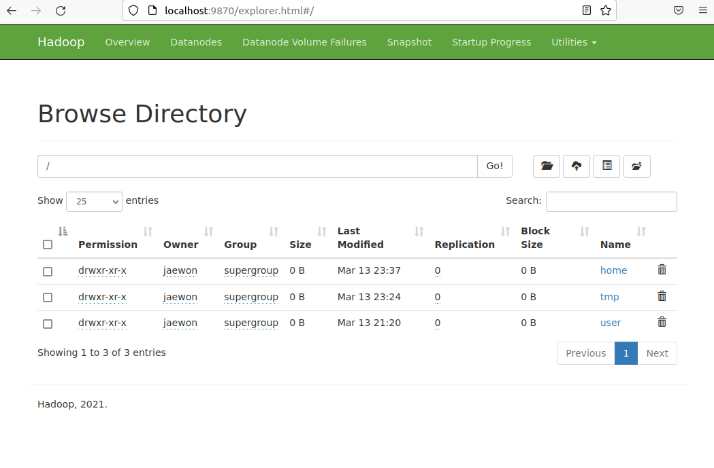


yarn확인

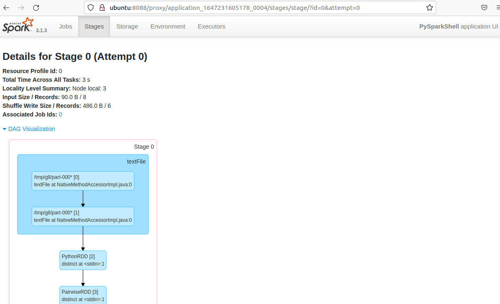


들어가기


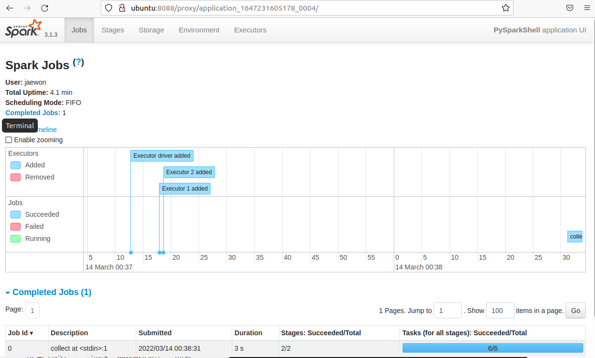


깨알 몰랐던거  소문자로 바꾸고 1넣어줌 x가 그냥(x.lower(),1))형태

```python
g8.map(lambda x:(x.lower(),1)).collect()
[('france', 1), ('italia', 1), ('canada', 1), ('japan', 1), ('korea', 1), ('united states america', 1), ('united kingdom', 1), ('germany', 1)]

```


`vim spark_wc.py` 안에 집어넣기 어떤 동작인지 확인

결과는 data.zip푼거의 txt파일의 제일 많이쓴 단어 찾기

```python
import sys, re
from pyspark import SparkConf, SparkContext

conf = SparkConf().setAppName('Word Count')  # 워드카운트라는 이름으로 
sc = SparkContext(conf=conf)

if (len(sys.argv) != 3):   # argv 몇개 들어왔는지 확인
    print("wordcount.py input_file output_dir 형태로 실행해 주세요")
    sys.exit(0)
else:
    inputfile = sys.argv[1]
    outputdir = sys.argv[2]
    
wordcount = sc.textFile(inputfile)\
           .repartition(10)\    			# 파티션 10개로 만듬 
           .filter(lambda x: len(x) > 0)\		# 인자의 길이가 0보다 큰거만 가져온다 													공백지우기 
            .flatMap(lambda x: re.split('\W+', x))\ # 정규식 처리  형태를x와 같게하고 														매치,최소한번반복
             .filter(lambda x: len(x) > 0)\		# 다시 0보다 큰거만 
              .map(lambda x:(x.lower(), 1))\	# ('france', 1) 이런형태로 만듬
              .reduceByKey(lambda x, y: x + y)\    # 키는 같고 벨류는 그냥 더해짐 최														종적으로 카운팅??
              .map(lambda x:(x[1], x[0]))\		# [1]벨류,[0]키??
              .sortByKey(ascending=False)\
              .persist()			# 메서드는 스토리지 레벨을 인자로 받아 저장 공간을 										정할 수 있다.

wordcount.saveAsTextFile(outputdir)
top10 = wordcount.take(5)
result = []
for counts in top10:
    result.append(counts[1])
print(result)
```

```scala
py 파일만 머하는 놈인지 분석
spark_wc.py 실행 하는데 shakespeare.txt 를 result 디렉토리 에 결과 넣어줘
hdfs dfs -rm -r /user/jaewon/result  # 실행 X 잘못된 결과 파일 지운거
spark-submit spark_wc.py ~/data/shakespeare.txt ~/result

hdfs dfs -cat ~/result/part-00000   # 어떤 단어 몇개? 출력


```

stop-all.sh   `하둡종료`

**종료전 필수!!!**

`stop-all.sh`

stop-all.sh

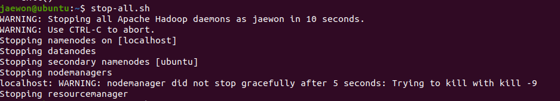

# zeppelin 

다운받고 

```
wget https://dlcdn.apache.org/zeppelin/zeppelin-0.10.1/zeppelin-0.10.1-bin-netinst.tgz
```

압축해제 및 심볼링크 만들기 

```scala
tar -xvzf zeppelin-0.10.1-bin-netinst.tgz 
ln -s zeppelin-0.10.1-bin-netinst zeppelin
```

