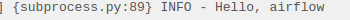
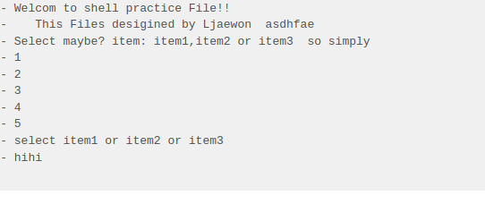
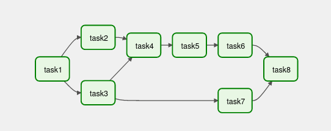
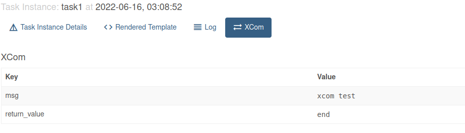
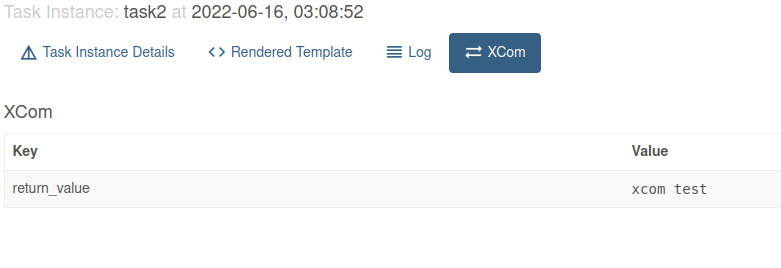
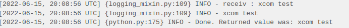
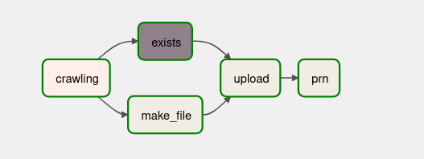
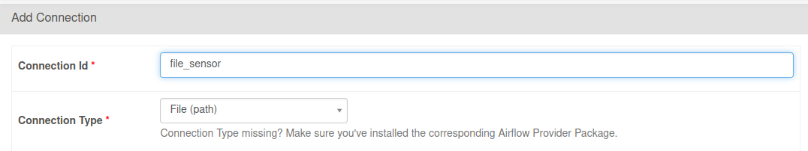

프로젝트때 급하게 한거라 정리할겸 다시 해보기 

---

# Airflow

**정의 Airflow : **

- Airbnb에서 만든 Workflow를 코드로 정의, 예약, 실행 및 모니터링 하는 오픈소스 플랫폼 
- DAG (Directed Acyclic Graph) 를 통한 간편한 시각화 
- 코드로 정의하였기 때문에 유지 관리, 버전 관리, 태스크 관리, 협업이 쉬워짐 
- data pipeline을 처리하기 위해 batch task 실행. (batch-oriented framework)


**특징**

- Scalable (확장성) : 모듈 형식으로 작성하여 프로그램을 확장하기 쉬움 
- Dynamic (동적) : python을 사용하여 파이프라인을 동적으로 인스턴스화 - 
- Extensible (확장가능성) : python 기반이기 때문에 여러 library를 이용한 확장 가능 
- Elegant (우아함) : 내장된 Jinja template engine을 사용하여 간결하고 명시적인 파이프라인 구성

**개념** 

- dag : 방향성 비순환 그래프(Directed Acyclic Graph). 작업 선택, 종속성 표현 (실행되는 순서 정의:  upstream >> downstream) -> 그래프가 순환되면, 상호 의존성으로 인해 deadlock에 빠질 수 있음
- task : 기본 실행(작업) 단위. 
- operator : task template. 단일 작업 실행. (task와 같은 의미로 사용되지만, 엄밀히 따지면 task는 operator manager)

**구조**


- Scheduler : task, dag 모니터링 -> task 예약
- Executor : task 객체를 실행시켜주는 역할 (default: SequentialExecutor)
- Worker : task 선택 및 실행
- Webserver : 말그대로의 웹서버 웹 ui 제공 
- Metastore : metadata database. scheduler, executor, webserver의 상태 저장
- User Interface : 사용자 환경 CLI 터미널
- Metadata Database : Scheduler가 파싱한 DAG와 Task 인스턴스 정보, Worker가 실행하면서 발생한 로그들이 airflow_db 라는 이름으로 저장


Task 실행시 Lifecycle 구간 마다 사용되는 Airflow 환경 변수를 그림으로 보여줌 


# Airflow-참고

공식 문서  

[Tutorial — Airflow Documentation (apache.org)](https://airflow.apache.org/docs/apache-airflow/stable/tutorial.html)

이건 bashoperator 할때 봤던거

[BashOperator — Airflow Documentation (apache.org)](https://airflow.apache.org/docs/apache-airflow/stable/howto/operator/bash.html)

FileSensor

[airflow.sensors.filesystem — Airflow Documentation (apache.org)](https://airflow.apache.org/docs/apache-airflow/stable/_api/airflow/sensors/filesystem/index.html?highlight=poke#airflow.sensors.filesystem.FileSensor)

[airflow.sensors.base — Airflow Documentation (apache.org)](https://airflow.apache.org/docs/apache-airflow/stable/_api/airflow/sensors/base/index.html#airflow.sensors.base.BaseSensorOperator)

fs_conn_id 설정할때 본거 Managing

[Managing Connections — Airflow Documentation (apache.org)](https://airflow.apache.org/docs/apache-airflow/stable/howto/connection.html)

# Airflow Code

- bash : airflow dags test {dag_id} {date} 
- airflow web에서 Trigger DAG  실행 후 로그 확인 가능 

```PYTHON
from airflow import DAG
from pendulum import yesterday, tomorrow
from airflow.operators.python import PythonOperator
from datetime import timedelta

# DAG 객체 생성
# airflow의 날짜, 시간에 pendulum 사용 (python datetime 객체와 동일)

dag = DAG(
    dag_id = 'air01',
    schedule_interval=timedelta(minutes=1),
    start_date= yesterday('Asia/Seoul')
)

def hello():
    print('Hello,Airflow!')


# python 함수 실행

task01=PythonOperator(
    task_id ='hello',
    python_callable=hello,
    dag=dag
)

```


timedelta를 사용하여 갱신중인것을 볼 수 있음 

`{logging_mixin.py:109} INFO - Hello,Airflow!`


```python
from airflow import DAG
from pendulum import yesterday
from airflow.operators.bash import BashOperator

dag = DAG(
    dag_id='air02',
    schedule_interval=None,
    start_date=yesterday('Asia/Seoul')
)

# bash script start
task02=BashOperator(
    task_id='hello',
    bash_command='echo Hello, airflow',
    dag=dag
)
```



airflow web에서 확인 가능

{} 내용이 살짝 다름 

BashOperator를 사용했었으니까 쉘 스크립트 sh 파일도 해보자

> 쉘 스크립트도 많이 까먹었다 재밌었는데.. 기본문법 간단하게 잡고 BashOperator에 써보자 

사용한 sh파일 쉘 스크립트 

간단하긴 한데 read반응이 airflow에서 어떨지 궁금해서 한번해봄 

```sh
#!/bin/sh


echo "Welcom to shell practice File!!
        This Files desigined by Ljaewon  asdhfae"

echo "Select maybe? item: item1,item2 or item3  so simply"


a=0

while [ "$a" -lt 5 ]
do
        a=$(expr $a + 1)
        echo $a
done


# while true ; do
#   echo "Please type something in (^C to quit)"
#   read INPUT_STRING
#   echo "You typed: $INPUT_STRING"
# done

echo "select item1 or item2 or item3"

while true ; do
        echo "hihi"
        read item
        case $item in
                "item1")
                        echo " you want stop? "
                        echo "(y/n)" # Yes|yes|y|Y) case 하나 더 사용해서 이런식도 나쁘지 않을듯
                        read a

                        if [ "$a" = "y" ]; then
                                break
                        else
                                continue
                        fi
                ;;
                "item2" | "item3")
                        echo "2 or 3"
                        echo "???"

                        cd /home/jaewon
                        cat starbucks_all.json
                ;;

                *) echo "Jush default"
                   echo " Try Again"
                ;;
        esac
done
```

실행하면 대충 아래와 같이 된다


요건 적용코드 

```python
from airflow import DAG
from pendulum import yesterday
from airflow.operators.bash import BashOperator

dag = DAG(
    dag_id='air02',
    schedule_interval=None,
    start_date=yesterday('Asia/Seoul')
)

templated_command="sh /home/jaewon/sh_code/while_pre.sh"
# 'sh /home/jaewon/sh_code/while_pre.sh'

# bash script start
task02=BashOperator(
    task_id='hello',
#    bash_command='echo Hello, airflow',
    bash_command=templated_command,
    dag=dag
)

```

`TemplateNotFound(template)
jinja2.exceptions.TemplateNotFound: sh /home/jaewon/sh_code/while_pre.sh`

근데 요런 에러떠서 안됨 

읽어보니 templated_command 즉 sh파일의 경로를 찾지 못했다는 거였음 그래서 공식문서 확인해봄

[BashOperator — Airflow Documentation (apache.org)](https://airflow.apache.org/docs/apache-airflow/stable/howto/operator/bash.html)

sh라고 명령어 그대로 쓰는게 아니였음 

바꾼후에 코드

```python
from airflow import DAG
from pendulum import yesterday
from airflow.operators.bash import BashOperator

dag = DAG(
    dag_id='air02',
    schedule_interval=None,
    start_date=yesterday('Asia/Seoul'),
    template_searchpath='/home/jaewon/sh_code',
)

# templated_command="sh /home/jaewon/sh_code/while_pre.sh"
# 'sh /home/jaewon/sh_code/while_pre.sh'

# bash script start
task02=BashOperator(
    task_id='hello',
    bash_command='while_pre.sh',
    dag=dag
)
```

**template_searchpath** 라는걸 사용해서 위치 지정후에 사용 template_searchpath쓸게 아니라면 dags밑에 넣어야함  그래서 결과는




read에 값을 넣을수 없었음... 혹시나 했는데 

Jinja 라고 재밌어 보이는거 찾았는데 값을 전달해줄수는 있는듯 하다 나중에 공부하다 사용할 기회가 올듯 하다.


[Crontab.guru - The cron schedule expression editor](https://crontab.guru/)

1번에서 한건데 스케쥴 반복하는 것만 정리함

start_date : time window 시작(start_date에 실행되는 것이 아님!) 

end_date : time window 끝 

schedule_interval : start_date부터, data를 수집하는 간격

schedule_interval 

- cron */1 * * * * : 1분마다

-  timedelta 

  timedelta(minutes=1) : 매 분 

  timedelta(hours=1) : 매시간

- cron presets None : 스케쥴링 하지 않음 (트리거 되는 dag에서 사용)

  @once : 한번 

  @hourly : 매시간 (0 * * * *) 

  @daily : 매일 자정 (0 0 * * *) 

  @weekly : 매주 일요일 아침 자정 (0 0 * * 0) 

  @monthly : 매월 1일 자정 (0 0 1 * *) 

  @quarterly : 분기별 1일 자정 (0 0 1 */3 *) 

  @yearly : 매년 1월 1일 자정 (0 0 1 1 *)

-------

`DummyOperator`  :아무 작업도 하지 않는 오퍼레이터로 그냥 작업 분류시키는데 사용

```python
from airflow import DAG
from pendulum import today
from airflow.operators.dummy import DummyOperator

dag = DAG(
    dag_id='air07',
    schedule_interval=None,
    start_date=today()
)

task1 = DummyOperator(task_id="task1", dag=dag)
task2 = DummyOperator(task_id="task2", dag=dag)
task3 = DummyOperator(task_id="task3", dag=dag)
task4 = DummyOperator(task_id="task4", dag=dag)
task5 = DummyOperator(task_id="task5", dag=dag)
task6 = DummyOperator(task_id="task6", dag=dag)
task7 = DummyOperator(task_id="task7", dag=dag)
task8 = DummyOperator(task_id="task8", dag=dag)


# fan-out (1:n)
task1 >> [task2, task3]  # [] 를 사용해서 병렬처리 
# fan-in (n:1)
[task2, task3] >> task4  # 병렬처리의 결과가 task4로 
task4 >> task5 >> task6 
task3 >> task7   		# task3 에서 4로 
[task6, task7] >> task8 # 병렬처리 
```





`spark-submit ` 스파크 세션을 사용할때 에어플로 자체에서는 접속하지 못한다 그래서 따로 그런 기능을 하는 파일을 연결해야함  

```python
from airflow import DAG
from pendulum import yesterday
from airflow.providers.apache.spark.operators.spark_submit import SparkSubmitOperator


dag = DAG(
dag_id='air11',
schedule_interval=None,
start_date=yesterday('Asia/Seoul'),
catchup=False
)


# spark-submit /home/jaewon/airflow/dags/using_spark.py 과 같은 의미
# conn_id : browser -> Admin -> Connections 에 있음 (필요한 connection 추가나 수정 등 가능)

spark_submit_task = SparkSubmitOperator(
task_id='spark_submit_task',
application="/home/jaewon/airflow/dags/using_sql.py", # using_spark.py using_sql.py
conn_id='spark_default',
dag=dag
)
```

같이 application에 경로를 다 지정 할수있음

/airflow/dags/kafka 파일에 dags와 task부분만 들고옴

```python
dag = DAG(
    dag_id = 'kafka',
    schedule_interval=None,
    start_date = yesterday('Asia/Seoul'),
    catchup=False,  # dags 실행 간격 설정?
)


producer_data_task = PythonOperator(
    task_id = 'producer_data_task',
    python_callable = producer_data,
    dag=dag
)


consumer_data_tsak = PythonOperator(
    task_id = 'consumer_data_task',
    python_callable = consumer_data,
    dag=dag
)


spark_submit_task = SparkSubmitOperator(
    task_id='spark_submit_task',
    application="/home/jaewon/airflow/dags/using_sql.py",
    conn_id='spark_default',
    dag=dag
)


producer_data_task >> consumer_data_tsak >> spark_submit_task 
```


`매크로 사용` {{ ds }}


터미널에서 실행시켜봄 

```terminal
~/airflow/dags$ airflow dags test hello_today 2022-06-16  # 실행 
[2022-06-15 17:28:40,016] {dagbag.py:500} INFO - Filling up the DagBag from /home/jaewon/airflow/dags
[2022-06-15 17:28:40,465] {base_executor.py:85} INFO - Adding to queue: ['<TaskInstance: hello_today.date backfill__2022-06-16T00:00:00+00:00 [queued]>']
[2022-06-15 17:28:45,452] {taskinstance.py:1448} INFO - Exporting the following env vars:
AIRFLOW_CTX_DAG_OWNER=airflow
AIRFLOW_CTX_DAG_ID=hello_today
AIRFLOW_CTX_TASK_ID=date
AIRFLOW_CTX_EXECUTION_DATE=2022-06-16T00:00:00+00:00
AIRFLOW_CTX_DAG_RUN_ID=backfill__2022-06-16T00:00:00+00:00

[2022-06-15 17:28:45,459] {subprocess.py:85} INFO - Output:
[2022-06-15 17:28:45,460] {subprocess.py:89} INFO - Hello! Today is 2022-06-16 # 결과

[2022-06-15 17:28:45,502] {backfill_job.py:851} INFO - Backfill done. Exiting.
~/airflow/dags$ airflow dags test hello_today 2019-11-27  # 실행

[2022-06-15 17:29:53,852] {subprocess.py:89} INFO - Hello! Today is 2019-11-27 # 결과

```

직접 터미널에 입력해서 그런거긴한데 {{ ds }} 안에 내용이 들어갔다 


코드 내용

```python
from airflow.operators.bash_operator import BashOperator
from airflow.models import DAG
from datetime import datetime, timedelta

#args = {    # 한마디로 DAG에 사용할수 있는 추가적인 변수라고 여겨짐 default_args를 사용해서 연결
#    'owner': 'airflow',
#    'start_date': datetime(2018, 11, 1)
#}

dag = DAG(
    dag_id='hello_today',
#    default_args=args,
    schedule_interval="@once",
    start_date=datetime(2019,11,1),  # poss? 안되더라 ㅋㅋ
    )

# Bash Operator
cmd = 'echo "Hello! Today is {{ ds }}"'
BashOperator(task_id='date', bash_command=cmd, dag=dag)

--- 결과  ---
Hello! Today is 2022-06-16
음.. args안쓰고 해볼려고 했는데 안됐음 start_date 이게 말이 똑같아서 될줄 알았는데 인식이 안되나봄
args써도 안되네 시간을 정해주지 않았는데 왜....?? 현재시간일까
```


jinja 해볼려 했는데 flask의 template언어라 그런지 안먹더라.. 아직은 flask써볼 생각 없어서 전달으로만해봄

아마 sh파일에 template언어 들어가서 그랬던..??

`jinja2.exceptions.TemplateNotFound` 이거 그냥 bash_command='' 뒤에 공백 하나 추가하면됨

추가 했다가 파일 못찾아서 다시 지우니까 갑자기됨??


일단 sh파일은 여기에 적진 않는다 간단한데 쓸데없이김 

```python
from airflow.operators.bash_operator import BashOperator
from airflow.models import DAG
from datetime import datetime, timedelta
from pendulum import yesterday
from airflow.operators.python import PythonOperator

dag = DAG(
   dag_id='air_jinja',
   schedule_interval="@once",
   start_date=yesterday('Asia/Seoul'),
   template_searchpath='/home/jaewon/sh_code',
)

def templated_test(d1):
    print("{{ ds }}")
    print("ds test:", d1)

test1 = 'It would be passes, but jinja does not word {{ ds }} '

task=BashOperator(
    task_id='test_jinja',
    bash_command='jinja.sh',
    params={'test':test1},  # 변수 넣어주기 가능
    dag=dag,
)

task2=PythonOperator(
    task_id='python_task',
    python_callable=templated_test,
    op_args=["{{ ds }}"], # 함수에 변수 받아주기 가능 
    dag=dag,
)

task >> task2

```

BashOperator 결과물 

```terminal
[2022-06-15, 18:45:11 UTC] {subprocess.py:85} INFO - Output:
[2022-06-15, 18:45:11 UTC] {subprocess.py:89} INFO - <DAG: air_jinja>, <Task(BashOperator): test_jinja>
[2022-06-15, 18:45:11 UTC] {subprocess.py:89} INFO - ds : 2022-06-16
[2022-06-15, 18:45:11 UTC] {subprocess.py:89} INFO - ds_nodash : 20220616
[2022-06-15, 18:45:11 UTC] {subprocess.py:89} INFO - prev_ds : 2022-06-16 # airflow는 미래시간 못써서 그대론듯 
[2022-06-15, 18:45:11 UTC] {subprocess.py:89} INFO - prev_ds_nodash : 20220616
[2022-06-15, 18:45:11 UTC] {subprocess.py:89} INFO - next_ds : 2022-06-16
[2022-06-15, 18:45:11 UTC] {subprocess.py:89} INFO - next_ds_nodash : 20220616
[2022-06-15, 18:45:11 UTC] {subprocess.py:89} INFO - yesterday_ds : 2022-06-15
[2022-06-15, 18:45:11 UTC] {subprocess.py:89} INFO - yesterday_ds_nodash : 20220615
[2022-06-15, 18:45:11 UTC] {subprocess.py:89} INFO - tomorrow_ds : 2022-06-17
[2022-06-15, 18:45:11 UTC] {subprocess.py:89} INFO - tomorrow_ds_nodash : 20220617
[2022-06-15, 18:45:11 UTC] {subprocess.py:89} INFO - ts : 2022-06-16T01:45:09.101685+00:00
[2022-06-15, 18:45:11 UTC] {subprocess.py:89} INFO - ts_nodash : 20220616T014509
[2022-06-15, 18:45:11 UTC] {subprocess.py:89} INFO - ts_nodash_with_tz : 20220616T014509.101685+0000
[2022-06-15, 18:45:11 UTC] {subprocess.py:89} INFO - macros.ds_add(ds, 2) : 2022-06-18
[2022-06-15, 18:45:11 UTC] {subprocess.py:89} INFO - macros.ds_add(ds, -2) : 2022-06-14
[2022-06-15, 18:45:11 UTC] {subprocess.py:89} INFO - macros.ds_format(ds, '%Y-%m-%d', '%Y__%m__%d'): 2022__06__16
[2022-06-15, 18:45:11 UTC] {subprocess.py:89} INFO - macros.datetime.now() : 2022061518
[2022-06-15, 18:45:11 UTC] {subprocess.py:89} INFO - <DAG: air_jinja>, <Task(BashOperator): test_jinja>
[2022-06-15, 18:45:11 UTC] {subprocess.py:89} INFO - It would be passes, but jinja does not word {{ ds }}
[2022-06-15, 18:45:11 UTC] {subprocess.py:89} INFO - execution_date : 2022-06-16T01:45:09.101685+00:00
[2022-06-15, 18:45:11 UTC] {subprocess.py:89} INFO - ds: 2022-06-16
[2022-06-15, 18:45:11 UTC] {subprocess.py:89} INFO - the day after tommorow with no dash format
[2022-06-15, 18:45:11 UTC] {subprocess.py:89} INFO - 20220618
[2022-06-15, 18:45:11 UTC] {subprocess.py:89} INFO - 0 2022-06-16
[2022-06-15, 18:45:11 UTC] {subprocess.py:89} INFO - 20220616
[2022-06-15, 18:45:11 UTC] {subprocess.py:89} INFO - 1 2022-06-16
[2022-06-15, 18:45:11 UTC] {subprocess.py:89} INFO - 2 2022-06-16
[2022-06-15, 18:45:11 UTC] {subprocess.py:89} INFO - 20220616
[2022-06-15, 18:45:11 UTC] {subprocess.py:89} INFO - 3 2022-06-16
[2022-06-15, 18:45:11 UTC] {subprocess.py:89} INFO - 4 2022-06-16
[2022-06-15, 18:45:11 UTC] {subprocess.py:89} INFO - 20220616
[2022-06-15, 18:45:11 UTC] {subprocess.py:93} INFO - Command exited with return code 0
```

PythonOperator 결과물

```terminal
2022-06-15, 18:45:13 UTC] {logging_mixin.py:109} INFO - {{ ds }}
[2022-06-15, 18:45:13 UTC] {logging_mixin.py:109} INFO - ds test: 2022-06-16
# 전달된 변수가 잘 넘어감을 확인할수있다.
```


`xcom` 각 task들끼리 값들을 주고받을수 있는 기능 

```python
from airflow import DAG
from pendulum import today
from airflow.operators.python import PythonOperator

dag = DAG(
        dag_id='air08',
        schedule_interval=None,
        start_date=today('Asia/Seoul')
)


# context의 task_instance (task 객체가 가지고 있는 xcom)
def send_function(task_instance):
    msg = 'xcom test'
    # task_instance.xcom_push(key='msg',value=msg)
    task_instance.xcom_push(key='msg',value=msg)
    x = 'end'
    return x  # return도 xcom식으로 되나 key가 미지정이라 부르기 힘들다

# context에서 task_instance 키를 통해 객체 참조
def receive_function(**kwargs):
    print(f"receiv : {kwargs['task_instance'].xcom_pull(task_ids='task1',key='msg')}")
    xcom = kwargs['task_instance'].xcom_pull(task_ids='task1',key='msg')
    print(xcom)

    return xcom 


task1 = PythonOperator(
task_id='task1',
python_callable=send_function,
dag=dag
)


task2 = PythonOperator(
task_id='task2',
python_callable=receive_function,
dag=dag
)

task1 >> task2
```

task1의 xcom



return으로 보낸값도 보내졌다고 한다

그외 task2에서는 `xcom test`라는 값만 도착했는데 key의 여부 혹은 로드한것이 하나만이기 때문인거같다.

만약 xcom이 로드가 아니라 보낸것만 보여준다면 합리적이다 마지막에 return으로 task2에서도 xcom을 해줬기 때문



둘다 xcom test라는 값이 잘 나오고 return했다 라는 것을 알수있다




xcom 으로 파일 만들기

```python
from pprint import pprint
from airflow import DAG
from pendulum import yesterday
from airflow.operators.python import PythonOperator
from airflow.operators.bash import BashOperator

dag = DAG(
    dag_id='air09',
    schedule_interval=None,
    start_date=yesterday('Asia/Seoul'),
    catchup=False
)

def print_context(**kwargs):
    pprint(kwargs)  # """Print the Airflow context and ds variable from the context."""
    return str(kwargs) # return을 시켜서 xcom 으로 보냄

task01=PythonOperator(
    task_id='print_context',
    python_callable=print_context,
    dag=dag
)

task02=BashOperator(
    task_id='save_context',
    bash_command='echo "{{ task_instance.xcom_pull(task_ids="print_context") }}" >> ~/context.json',
    dag=dag
)

# ~/ 해당 경로로 나가서 파일 만들어진거 확인

```

```terminal
cat context.json
```


sensor 

- 한 가지 작업만 하는 operator
- 특정 조건이 true인지 지속적으로 확인, false이면 true가 되던가 타임아웃(default : 7일)이 될 때까지 계속 확인

```python
import json
from airflow import DAG
from pendulum import yesterday
from airflow.operators.python import PythonOperator
from airflow.operators.bash import BashOperator
from airflow.sensors.filesystem import FileSensor


dag = DAG(
dag_id='air10',
schedule_interval=None,
start_date=yesterday('Asia/Seoul'),
catchup=False
)

def python_task():
    dummy = {'key':'value'}
    return json.dumps(dummy)

crawling = PythonOperator(
    task_id='crawling',
    python_callable=python_task,
    dag=dag
)
make_file = BashOperator(
    task_id='make_file',
    bash_command='echo "{{ task_instance.xcom_pull(task_ids="crawling") }}" >> /home/jaewon/dummy.json',
dag=dag
)

# 30초마다 filepath에 file이 있는지 확인, 없으면 대기 있으면 다음 task 진행
exists = FileSensor(
    task_id="exists",
    fs_conn_id='file_sensor',  			# ??? where?? 
    filepath="/home/jaewon/dummy.json", # fs_conn_id ~ recursive는 필수변수인거 같다
    recursive='False',  				# 재귀를 확인 False가 default
    poke_interval= 30,
    dag=dag
)

# hadoop에 파일 저장
upload = BashOperator(
    task_id='upload',
    bash_command='hdfs dfs -put /home/jaewon/dummy.json user/jaewon/dummy.json',
    dag=dag
)


prn = BashOperator(
    task_id='prn',
    bash_command='echo "success makefile & upload"',
    dag=dag
)


crawling >> [make_file, exists] >> upload >> prn

```

filesystem 변수 확인 poke_interval이  base에서 상속받아 filesystem에서 사용함

filesystem : [airflow.sensors.filesystem — Airflow Documentation (apache.org)](https://airflow.apache.org/docs/apache-airflow/stable/_api/airflow/sensors/filesystem/index.html?highlight=poke#airflow.sensors.filesystem.FileSensor)

poke_interval : [airflow.sensors.base — Airflow Documentation (apache.org)](https://airflow.apache.org/docs/apache-airflow/stable/_api/airflow/sensors/base/index.html#airflow.sensors.base.BaseSensorOperator)

완성




참고 [Managing Connections — Airflow Documentation (apache.org)](https://airflow.apache.org/docs/apache-airflow/stable/howto/connection.html)

`fs_connid_id 등록하는법`

```
Airflow 상단의 Admin->connections->하나 add한 후에 아래처럼 만듬
```





