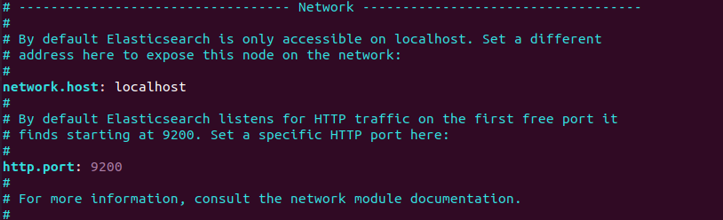
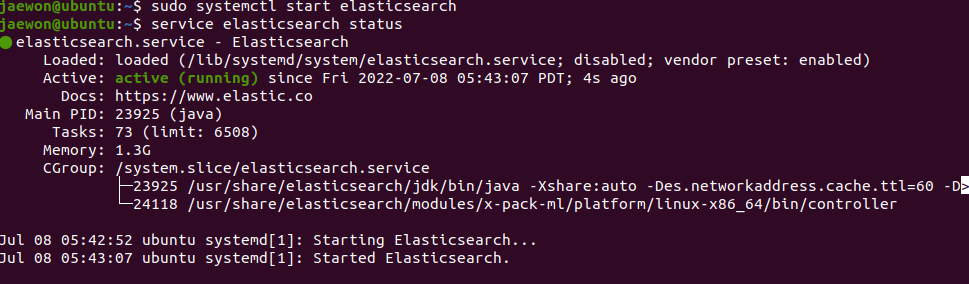
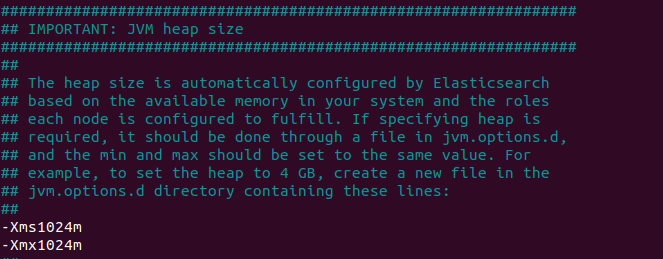
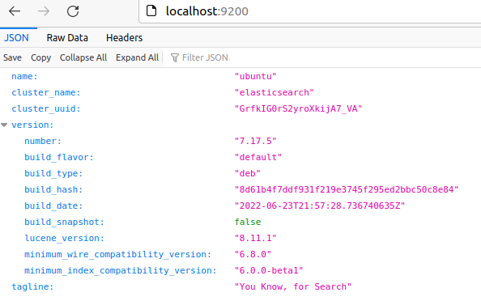
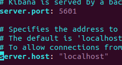

# Elasticesearch

## 다운 방법

```terminal
curl -fsSL https://artifacts.elastic.co/GPG-KEY-elasticsearch | sudo apt-key add -
```

위 명령어 이용해서 키 받고

```terminal
echo "deb https://artifacts.elastic.co/packages/7.x/apt stable main" | sudo tee -a /etc/apt/sources.list.d/elastic-7.x.list
```

> sources.list.d 폴더에 Elastic 소스리스트를 추가 APT 가 새로운 소스를 찾게만듬 

```terminal
sudo apt update
sudo apt install elasticsearch   # 설치


sudo nano /etc/elasticsearch/elasticsearch.yml # 아래 사진과 같은 설정을 해줌
```




good




## 실행키

```terminal
sudo systemctl start elasticsearch	# 수동으로 키기
service elasticsearch status 		# 확인 

sudo systemctl enable elasticsearch  # 컴이 켜지면 자동실행 
```

active running  == 정상작동


## 추가적인 설정

엘라스틱 서치의 힙스택 설정을 해줬다.

```terminal
sudo nano /etc/elasticsearch/jvm.options
```



> 엘라스틱 서치에서 사용하는 힙크기이고 일반적으로는 사용가능 메모리의 절반정도를 사용하지만 최대 크기가 32Gb를 넘지 않도록 한다. 실제로 JVM이 32기가 제한을 초과하면 몇가지 메모리를 처리하는데 좋지않다. 실제로 많은 사람들이 이것을 초과하지 않는것을 권장하며 30~31기가 정도를 최대로 한다. 32기가 메모리가 있는 시스템이라면 1/3을 권장 한다 나는 전체 5.3G정도 되니 일단 1G로 해줬다.




설정된 포트번호로 접속! 값이 JSON으로 뜬다면 성공

```terminal
curl -XGET localhost:9200
{
  "name" : "ubuntu",
  "cluster_name" : "elasticsearch",
  "cluster_uuid" : "GrfkIG0rS2yroXkijA7_VA",
  "version" : {
    "number" : "7.17.5",
    "build_flavor" : "default",
    "build_type" : "deb",
    "build_hash" : "8d61b4f7ddf931f219e3745f295ed2bbc50c8e84",
    "build_date" : "2022-06-23T21:57:28.736740635Z",
    "build_snapshot" : false,
    "lucene_version" : "8.11.1",
    "minimum_wire_compatibility_version" : "6.8.0",
    "minimum_index_compatibility_version" : "6.0.0-beta1"
  },
  "tagline" : "You Know, for Search"
}
# 또다른 확인방법
```


# Kibana 

**Elastic에서 제공하는 오픈소스 데이터 대시보드/시각화 툴**이다

## 다운방법

엘라스틱 서치 보다 쉬운데 일부 과정이 동일함 키얻고 뭐하는 그런거 그래서 추가적인 방법만 적음

```terminal
sudo apt-get update && sudo apt-get install kibana
sudo vim /etc/kibana/kibana.yml

sudo /bin/systemctl enable kibana.service  # 부팅시 자동실행 키기 
sudo systemctl start kibana.service  	# 실행키
```



설정바꿔주고 


화면 나오면 성공!

# Error

```terminal
Job for elasticsearch.service failed because the control process exited with error code.
See "systemctl status elasticsearch.service" and "journalctl -xe" for details.

```

란 말이 나오면 일단 기존 설정을 풀어준다 나같은 경우는 힙크기를 해주니 일단 성공했음

굉장히 상세하게 해당 에러에 관해 정리되어있다.

[Elasticsearch: Job for elasticsearch.service failed - Stack Overflow](https://stackoverflow.com/questions/58656747/elasticsearch-job-for-elasticsearch-service-failed)