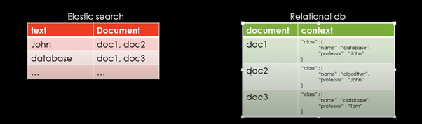
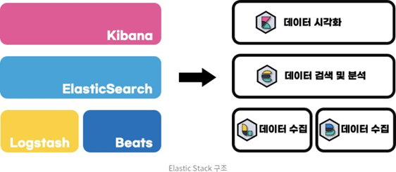

# **1.** 강력한 검색 기능

엘라스틱 서치는 검색엔진에 많이 쓰이며(ex. Github, Stackoverflow, Wikipedia, Goldman Sachs 등) 최근에는 빅데이터 로그 분석(Log Analytics), 메트릭 분석 등으로도 많이 사용되고 있다. 기존 데이터베이스에서 하기 힘들었던

전문검색(Full-Text Search), 문서의 점수화를 통한 정렬, 데이터 증가량에 상관 없는 실시간 검색 등을 구현 할 수 있다.

 

# **2.** 대규모 분산 시스템 구축 지원

elastic에서 지원하는 클라우드 서비스 외에도 AWS나 Azure, Hadoop과 같은 빅데이터 플랫폼과의 연동도 쉽게 가능

# **3.** 아파치 루씬 기반

JAVA로 개발된 검색 라이브러리인 아파치 루씬을 기반으로 만들어짐 그래서 루씬의 기능을 대부분 지원하며 JAVA로 개발 됐기 때문에 JAVA가 설치되어 있어야 한다.

->루씬이랑 엘라스틱서치가 뭐가다른거야?

루신은 자바 기반 검색 라이브러리고 엘라스틱서치는 어플리케이션임 그냥 여행상품이랑 패키지여행상품같은 차이라 생각하자…

**1.** 실시간 분석**(Real Time)**

저장된 데이터가 검색에 사용되기 위해 별도의 재시작이나 상태 갱신이 필요하지 않다. indexing이 완료됨과 동시에 바로 검색(Real Time)이 가능.

**3.** 분산 시스템**(Distributed System)**

엘라스틱 서치는 여러 개의 노드로 구성된 분산(Distributed)시스템. 노드란 데이터를 indexing하고 검색 기능을 수행하는 엘라스틱 서치의 단위 프로세스다. 시스템 규모에 따라 노드를 더 연결하거나 분리하면서 유연하게 시스템을 확장하거나 축소할 수 있다.

**4.** 높은 가용성**(High Avaliability)**

엘라스틱 서치는 한 개 이상의 노드로 구성되고 각 노드는 1개 이상의 데이터 원본과 복사본을 가지고 서로 다른 위치에 나누어 저장한다. 노드가 종료되거나 실행에 실패할 때 엘라스틱 서치는 노드의 상태를 감지하고 종료된 노드의 데이터를 다른 노드로 옮김으로서 항상 일저한 데이터의 복사본 개수를 유지하는데, 이를 통해서 높은 가용성(High Avaliability)과 안전성을 보장.

-> 복사본은 개수는 유지하는데 왜 데이터 소실되면 위험하다고했던건지 모르겟음…

**5.** 멀티 테넌시**(Multi Tenancy)**

엘라스틱 서치의 데이터는 여러 개의 분리된 인덱스들(Indices)에 그룹으로 저장한다. 인덱스는 관계형 DB에서 데이터베이스와 대응 대는 개념인데, 관계형 DB에서 다른 데이터베이스의 데이터를 검색하려면 별도의 커넥션을 생성해야되지만 엘라스틱 서치에서는 검색할 때, 서로 다른 인덱스의 데이터를 하나의 질의로 묶어서 검색하고 하나의 출력으로 모아줄 수 있다. 이런 특징을 멀티 테넌시(Multi Tenancy)라 한다.

**6.** 전문검색**(Full Text Search)**

엘라스틱 서치는 데이터 Indexing을 통한 전문 검색(Full Text Search)이 가능.

**7.** **JSON** 문서 기반

엘라스틱 서치에서는 기본적으로 문서의 모든 필드가 indexing되어서 JSON 구조로 저장된다. 그래서 모든 레벨의 필드에 접근이 쉽고, 매우 빠른 속도로 검색이 가능.

 

- 색인(index)란?

​		문서에서 키워드를 찾아보기 쉽도록 정렬/나열한 목록

- 역색인(inverted index)란?

​		키워드를 통해 문서를 찾아내는 방식, 문서 내의 문자와 같은 내용물 의 맵핑 정보를 색인

​		-> 역색인 구조의 이점: 검색이 매우 빠르다

**일반 색인(forward index)은 책의 목차**와 같은 의미이고, **역색인(inverted index)은 책 가장 뒤의 단어 별 색인 페이지**와 같다.

mysql 에서 pointer라는 단어가 포함된 문서를 찾는다고 가정하자

select doc_id

from documents

where doc_contert like '%pointer%'

이런식으로 작성할텐데 이때 모든 row에 대해서 like를 수행하기 때문에 데이터가 늘면 늘수록 속도가 현저히 떨어지게된다

하지만 역색인 구조를 생성해 두면 키워드 색인을 통해 문서 id 를 바로 찾을 수 있다.

ES의 역색인을 활용하면 대소문자 구분 없이 어떤 문구가 들어와도 찾을 수 있다.

엘라스틱서치와 관계형 데이터베이스의 저장 구조 예시

<엘라스틱서치 vs 관계형 데이터베이스 용어 비교>

 

Index     			 /   Database

Type       			/   	Table

 Document   	 /    	Row

 Field   				/  	  Column 

Mapping       	 /   	Schema

GET        		   /   	Select

PUT     			  /	 Update

POST      		/ 	    Insert

DELETE     /   Delete

 

 

<엘라스틱스택 구조>

 

<ELK란? = Elastic stack과 같은말이다>

 E : Elastic Search

L : Logstash 

K.: Kibana

ELK를 왜써?

로그레벨 파악, 검색어 분석을 용이하게 하려고

굉장히 정리 잘된 블로그 : [[Elastic Search\] 기본 개념과 특징(장단점). 엘라스틱서치의 기본 개념, 특징에 대해 정리 | by Jaemun Jung | Medium](https://jaemunbro.medium.com/elastic-search-기초-스터디-ff01870094f0)

개념은 여기까지 하고 직접 조금씩 해보면서 하는게 나을듯..? 기회가 된다면