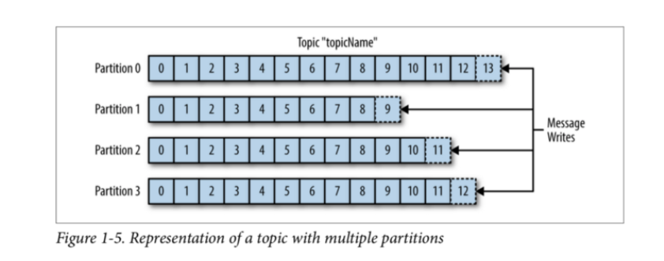
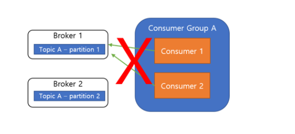
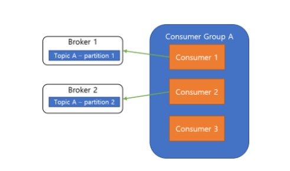
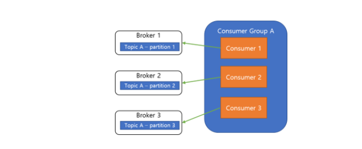
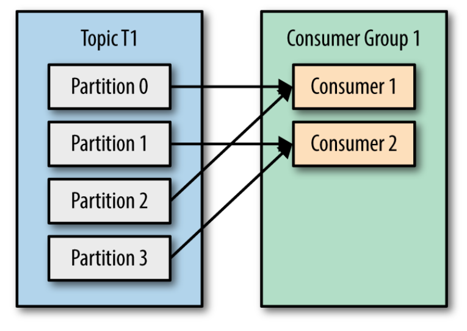
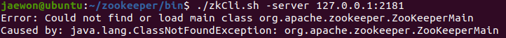
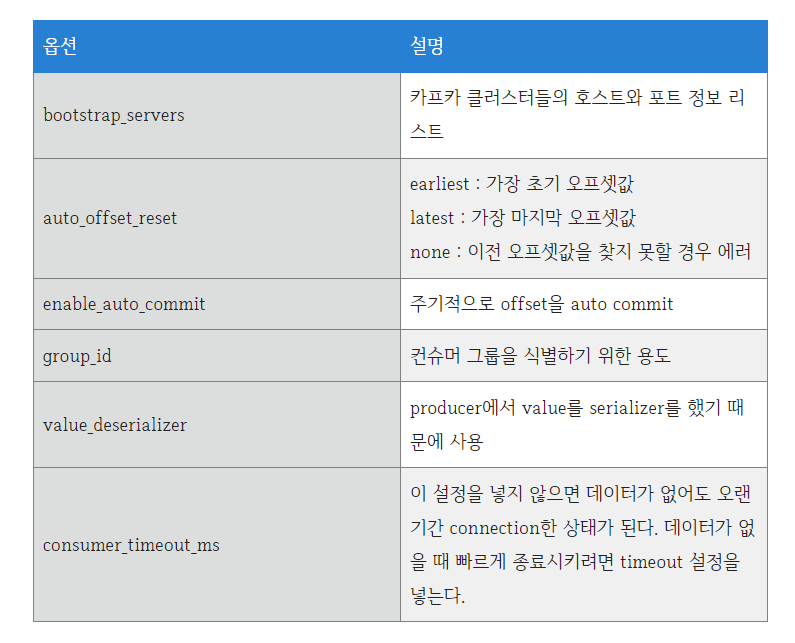

# MOM(Message-oriented middleware)

-  응용 소프트웨어 간의 데이터 통신을 위한 소프트웨어
-  일반적으로 비동기 메시지 전달에 기초

장점

- 메시지 기반 통신 프로토콜의 장점은 메시지를 전달하는 과정에서 보관하거나 라우팅 및 변환 할 수 있다는 점이다.
- 많은 메시지 지향 미들웨어는 전송되는 메시지의 백업을 유지함으로써 지속성을 제공한다. 즉, 송신 측과 수신 측 동시에 네트워크에 연결되어 있을 필요는 없다. 이는 네트워크의 품질이 낮거나 사용자가 임의로 전화 거는 경우나, 연결 시간에 제한이 있는 경우, 연결이 간헐적인 경우에 특히 유용하다. 또한 수신 측에서 문제가 발생하여 응용 프로그램이 중지되어 버려도 송신 측은 이에 영향을 받지 않고 전송을 계속할 수 있으며, 메시지를 저장해놓고 나중에 수신 응용 프로그램이 재개될 때 처리가 이루어진다.


# kafka 기초 개념

H,S랑 k랑 똑같은 스트림임


독립적인 녀석이라 하둡에코에 굳이 연결할 필요는 없으나 관리는 주키퍼의 관리를 받는다.


- 파이프 라인 확장이 쉽다, 더빠른처리 가능 
- 이벤트?,메시지
  - 프로듀서와 컨슈머가 데이터를 주고받는 단위  (POST?)
- 프로듀서? 
  - 카프카에 이벤트를 알려주는 클라이언트 어플
- 컨슈머?
  - 토픽을 이용해서 얻은 데이터로 이벤트를 처리하는 클라이언트 어플
- 토픽?(TOPIC)
  - 이벤트가 쓰이는곳 프로듀서는 이 토픽에 이벤트를 저장 그리고 컨슈머는 토픽으로부터 이벤트를 가져와 처리 //토픽은 파일시스템의 폴더와 유사하며,이벤트는 폴더안의 파일과 유사, 토픽에 저장된 이벤트는 필요한 만큼 다시 읽을 수 있다.
- 파티션 
  - 토픽은 여러 Broker에 분산저장되며 이렇게 분산된 토픽을 파티션이라함 어떤 이벤트가 파티션에 저장될지 이벤트의 key가 결정하고 같은키의 이벤트는 항상 같은 파티션에 저장된다
- 브로커 : 하나의 카프카 서버
  - 프로듀서로부터 메시지를 수신하고,오프셋을 지정한후 ,해당 메시지를 디스크(토픽?)에 저장
  - 컨슈머의 파티션 읽기 요청에 응답 ,수록도니 메시지 전송
- 클러스터: 카프카의 브로커는 클러스터의 일부로 동작한다.
  - 여러개의 브로커가 하나의 클러스터에 포함될수있다
  - 그중 하나는 자동으로 선정되는 클러스터의 컨트롤러가 된다. 
  - 다중 클러스터: 카프카가 많이 설치되어 사용될때 고려


**kafka는 topic의 partition에 지정된 consumer가 항상 정확히 동일한 순서로 partiton의 이벤트를 읽을것을 보장**

## 장점

- 다중 프로듀서
  - 여러 클라이언트가 많은 토픽을 사용하거나,같은 토픽을 같이 사용해서 무리없이 많은 프로듀서 이벤트 처리 가능
- 다중 컨슈머
  -  많은 컨슈머가 상호 간섭 없이 어떤 메시지 스트림도 읽을 수 있다
- 디스크 기반 보존
  - 지속해서 메시지 보존 가능, 데이터 유실 위험 없음 컨슈머가 실시간이지 않아도됨
- 확장성
  - 확장성이 좋아 어떤 크기의 데이터도 쉽게 처리 가능
- 고성능
  - 지금까지의 모든 기능들이 합쳐저 아파치 카프카를 고성능의 메시지 발행/구독 시스템으로 만들어준다.

# kafka 주요개념

- 컨슈머와 프로듀서의 분리
  - 위 두개는 완전 별개로 동작 프로듀서는 브로커의 토픽에 이벤트를 저장한 하면 되고 컨슈머는 broker의 특정 topic에 메시지를 가져와 처리하기만 하면됨 
- push 와 pull
  - 컨슈머는 pull 모델 기반으로 처리 브로커가 consumer에게 메시지를 전달이 아닌 컨슈머가 필요할때 브로커로부터 메시지를 가져와 처리 
    - 프로듀서의 부담을 덜고 컨슈머가 처리가능할때 pull해서 처리
    - 불필요한 지연이 없음



- 각파티션 한칸한칸이 log(로그) 메시지는 로그에 순차적으로 append 이 메시지의 상대적 위치를 offset이라고함 
- 메시징 시스템은 브로커에서 소비된 메시지에 대한 메타데이터를 유지 ,메시지가 전달되면 브로컨는 로컬에 기록하거나 소비자의 승인을 기다린다

commit과 offset 은 따로 찾아볼것  , rebalance도


컨슈머그룹내의 컨슈머들은 각기 다른 파티션에 연결되어야함 그래야 **메시지 처리순서보장**



이와같은 형태로는 불가

**컨슈머확장**



 컨슈머를 늘릴때는 해당 파티션도 늘려줘야함 



하지만 역순은 상관없다




컨슈머를 확장해서 부담을 줄인다는 개념은 같음 

- 차이
  - 다른 컨슈머가 같은 파티션에 접근불가

1:1이 가장 부담이 적음

컨슈머 그룹을 추가하면 그룹1과 무관하게 그룹2가 모든 토픽을 읽음

### 컨슈머 그룹 정리

- 각 어플리케이션에서 하나 이상의 토픽에 저장된 **모든 메시지**를 읽어야 할땐 애플리케이션 마다 컨슈머 그룹 생성 
- 토픽의 메시지 소비를 확장할때 기존 컨슈머 그룹에서 새 컨슈머 추가
- 해당 그룹의 각  컨슈머는 토픽의 일부 파티션


- commit 파티션 내부의 현재위치 변경


# commit offset

consumer의 sub // 이전에 commit 한 offset가 존재하면 해당 offset이후으 ㅣ메시지르 ㄹ읽어오게됨 또 읽어온뒤 마지막 offset을 commit 이어서 sub을 하면 방금전 commit한 offset이후의 메시지를 읽어와 처리

commit? 

카프카가 현재 저장한 또는 불러온 offset의 위치를 업데이트 하는것 

즉 어디까지 가져다가 썼는지를 기록하는 큐?

## 메시지(이벤트) 전달 컨셉

- At most once(최대한번)
  - 메시지가 `손실o`될 수 있지만, `재전달은 하지않음`
- At least once(최소 한번)
  - 메시지가 `손실x` ,`재전달 일어남`
- Exactly once(정확히 한번)
  - 메시지는 정확히 한번 전달됨


# Kafka..왜 pipeline??

## 파이프라인?

- 데이터가 수집,적재,저장 되는 일련의 과정
- 서로 다른 여러 시스템 간의 데이터 이동/흐름
- 효율적으로 구축-> 서로다른 시스템간의 데이터 전달과 통합을 효율적으로!

## 카프카를 이용?

1. 카프카가 두개의 엔드포인트중 하나
2. 카프카를 중개역할

적시성

- 하루에 한번 대량으로 데이터를 받는 **배치처리 시스템**이 있고
- 데이터 생성 즉시 수 밀리초 안에 받아야 하는 **실시간 처리 시스템**도 있다
- 확장성과 신뢰성이 있는! 스토리지를 갖춘! 스트리밍 데이터 플랫폼인 카프카
  - 실시간 파이프라인부터 시간 단위의 배치,파이프라인까지 모든것을 지원하는 **거대한 버퍼**가 될수있다
  - 데이터 쓰기와 읽기가 분리되어있어서


# zookeeper 3.6.3

왜 3.6.3?? The **stable** version of ZooKeeper is 3.6.x and the **current** version is 3.7.x

다운일 기준으로 안정적 버전이기때문에 

zookeeper??

> 하둡에코 시스템을 통합적으로 관리해주는 프레임워크
>
> 카프카의 사용을 위해 먼저 다운로드 한다.

순서대로만 하면 설치와 확인 가능 

````terminal
wget https://dlcdn.apache.org/zookeeper/zookeeper-3.6.3/apache-zookeeper-3.6.3-bin.tar.gz

tar -xzvf apache-zookeeper-3.6.3-bin.tar.gz  # 압축해제

ln -s apache-zookeeper-3.6.3-bin zookeeper # 심볼링크

mkdir -p zkdata # 지노드의 복사본인 스냅샷과 트랜잭션 로그를  저장할 데이터 디렉토리 또는 파일시스템을 생성

# 디렉토리명 또는 파일시스템명은 사용자가 원하는 이름으로 생성

# cd {ZOOKEEPER_HOME}/zookeeper/conf/  {ZOOKEEPER_HOME} 가 현재는 /home/jaewon 이다.

cd zookeeper
cd conf  # 해당 경로헤서 주키퍼 실행,관리,중지 가능 .sh 쉘스크립트로 실행함 

cp zoo_sample.cfg zoo.cfg

vim zoo.cfg
``` 내부작성 
## zoo.cfg 파일

## datdaDir 은 각각의 서버에 맞게 설정하는데 
dataDir=/zkdata

# the port at which the clients will connect
clientPort=2181
```
# 기본적으로 localhost(127.0.0.1) 주소로 서버를 기동하게 되어 있으니, 다른 IP 주소를 설정하고 싶은 경우에는 zkServer.sh 파일을 열어 localhost 부분을 원하는 IP Address로 변경

./zkServer.sh start # 주키퍼 시작 (전원킴)

./zkCli.sh -server 127.0.0.1:2181 # 해당 포트와 주소로 **시작**

주키퍼 화면에서 help로 도움말 보기가능

./zkServer.sh stop # 주키퍼 중지 
````

wget을 bin이 아니라 소스파일로 받게되면 생기는 에러 실제로 bin안에 몇몇의 실행권한이 잠겨있다.




- 주키퍼 환경- 멀티노드?? (해당 프로젝트에서는 일단 다루지 않을거기에 일단 진행하지 않음)
  - 진행하지 않는이유? 지금 하둡이 싱글모드이고 컴퓨터가 하나라서 실제로 aws도 사용가능 인스턴스가 하나이기때문에 분리할 자원과 자본이 없기때문에 한동안 주키퍼는 싱글노드로만 설정해서  진행함


연결안됨 에러

jps뜨길래 제대로 확인해 볼려고 stop두번했다가 기존 pid에 문제가 발생

no zookeeper to stop (could not find file /home/jaewon/zkdata/zookeeper_server.pid)

그냥 zoo.cfg의 z노드 파일을 지워버리고 그대로 새로 만들어줌 -> 실행잘됨


#  kafka 2.6.2

[지원되는 Apache Kafka 버전 - Amazon Managed Streaming for Apache Kafka](https://docs.aws.amazon.com/ko_kr/msk/latest/developerguide/supported-kafka-versions.html)

왜 2.8.1?? 다운일 기준으로  Amazon MSK 권장버전이 2.6.2였고 가장 최근이 2.8.1이였음

일단 권장버전으로 받아봄 

```terminal
wget https://archive.apache.org/dist/kafka/2.6.2/kafka_2.13-2.6.2.tgz

tar -xvzf kafka_2.13-3.0.0.tgz

ln -s kafka_2.13-3.0.0.tgz kafka

# kafka/config 에서 serverproperties 에서 카프카 로그파일만 만짐

주키퍼 받은곳에서 주키퍼 키고

cd kafka # 여기에서 

./bin/kafka-server-start.sh -daemon ./config/server.properties
# daemon이면 백그라운드 실행임 

# 중지는 start를 stop로 바꿔줄것! 
./bin/kafka-server-stop.sh -daemon ./config/server.properties
```

이후 jps 에서 주키퍼와 카프카가 적당한 포트에 할당된것을 볼수있음 


log 파일에 meta.properties를 삭제하면 멈춤현상이 제거됨 \

계속 꺼지는 현상도 해결 근데 일시적 해결이라는게 문제 

> \- delete.topic.enable : 토픽 삭제 기능을 ON/OFF (enable = 토픽 삭제 가능)
>
> \- default.replication.factor : 리플리케이션 팩터(Replication Factor) 옵션을 주지 않았을 경우의 기본값
>
> \- min.insync.replicas : 최소 리플리케이션 팩터
>
> \- auto.create.topic.enable : 존재하지 않는 토픽으로 퍼블리셔가 메시지를 보냈을 때 자동으로 토픽 생성
>
> \- log.retention.hours : 저장된 로그의 보관 주기
>
> \- compression.type : 토픽의 최종 압축 형태. gzip, snappy, lz4 등의 표준 압축 포맷 지원
>
> \- zookeeper.session.timeout.ms : 브로커와 주키퍼 사이의 최대 연결 대기 시간. 해당 시간동안 주키퍼와 연결되지 않으면 타임아웃
>
> \- message.max.bytes : 카프카에서 허용되는 가장 큰 메시지 크기


## 연결확인

사실상 주키퍼랑 카프카를 싱글노드로 사용하여 카프카 지노드로는 확인이 어렵다

해서 `cat /home/호스트명/kafka/logs/server.log` 로 확인을 해보았는데 어떤어떤 정보가 떴으니 연결된거지 않을까 한다.

추후 자세한 정보 업로드 


vim kafka/config/server.properties 시에

zookeeper.connect 같은 경우 현재 디폴트인데 이러면 주키퍼 루트노드에 작성된다고 한다


# kafka 예제들

연습을 하는데 topic이 안만들어졌음 에러 메시지는

`error while executing topic command : replication factor: 1 larger than available brokers: 0.`

이랬는데 상황을 보면 브로커를 잡아주지 못하는듯 하고 그것보다는 replication factor가 브로커보다 커질수 없기때문에 생기는 에러인듯 하다

일단

```terminal
kafka/config/ vim server.properties  # 에서

listeners=PLAINTEXT://:9092 #  카프카 브로커가 통신을 위해 열어둘 인터페이스 IP
advertised.listeners=PLAINTEXT://127.0.0.1:9092 # 카프카 클라이언트 혹은 라인툴에서 접속할 때 사용되는 IP와 port 정보를 입력한다. 
-- 들을 설정한다.

# 삭제
./bin/kafka-topics.sh --delete --zookeeper localhost:2181 --topic 토픽이름

그후 /kafka 에서 토픽생성 명령어 실행

./bin/kafka-topics.sh --create -zookeeper localhost:2181 --partitions 1 --replication-factor 1 --topic test
Created topic test.

# 토픽(topic) 리스트 확인
./bin/kafka-topics.sh -zookeeper localhost:2181 --list

# 좀더 상세한 정보 확인 가능 (특정토픽 확인 가능)
./bin/kafka-topics.sh -zookeeper localhost:2181 --describe

토픽에 설정된 옵션을 변경하기 위해서는 2가지의 명령을 사용합니다.
kafka-topics.sh : 파티션의 개수 변경
kafka-configs.sh : 리텐션 기간 변경

```


# producer.sh consumer.sh 예제

키값이 NULL이기 때문에 말그대로  테스트용??

## --bootstrap-server 연결 문제 

`--bootstrap-server <String: server to    REQUIRED: The server(s) to connect to. 
  connect to>`

`zookeeper is not a recognized option`

라면서 부트 스트랩을 필수로 연결해줘라 라고 한다 보통 구글링을 해도 원인을 찾을수는없는데 

그냥 생성 토픽과 프로,컨슈머의 포트가 같으면 된다 이전 test토픽은 -zookeeper:2181에다가 만들어 줬는데 hello 토픽은 localhost:9092에다가 만들어 줬고 그래서 해결됨 

```terminal
./bin/kafka-topics.sh --create --bootstrap-server localhost:9092 --topic hello

./bin/kafka-topics.sh -zookeeper localhost:2181 --list
hello
test    	# 근데 신기하게 주키퍼 포트로 잡아도 보여준다. 

./bin/kafka-console-producer.sh --bootstrap-server localhost:9092 --topic hello
-------------
# 프로듀서 창
>afasd
>multi.com
>
--------------------------------------------
./bin/kafka-console-consumer.sh --bootstrap-server localhost:9092 --topic hello --from-begin

# 컨슈머 창
afasd
multi.com
# 프로듀서와 컨슈머 창이 켜진상태에서 프로듀서가 보낸 메세지도 들어오고 이전에 있던 기존메시지도 남아있다.
------- 추가 sub
afasd
multi.com
for example
life for iakfa
1 123 , ; !
^CProcessed a total of 5 messages
# ctrl+c 로 끄고 끌때 총합 메시지를 보여줌
--------------------------------------------
# / 아직 컨슈머 그룹까지는 만들어 주지 않았고 이제 한번 해볼것이다.

# 컨슈머그룹을 정해지고 비기닝
./bin/kafka-console-consumer.sh --bootstrap-server localhost:9092 --topic hello --group G_test --from-beginning


# 컨슈머 그룹 정보확인
./bin/kafka-consumer-groups.sh --bootstrap-server localhost:9092 --group G_test --describe

# __consumer_offsets 컨슈머 쓰고난이후 topic list에 생김 
```

**만약 파티션 갯수가 1이 아니라면 sub의  메시지는 섞여서 오게되어있음 -이것은 하둡에 파티션을 나눠서 저장할때 순서가 섞이는것과 비슷하지만 현재나는 파티션이 하나이기때문에 순서가 섞이지는 않았다**


## 한서버에 파티션 여러개? 가능

```terminal
./bin/kafka-topics.sh --create  --bootstrap-server localhost:9092 --partitions 3 --replication-factor 1 --topic hello_kafka
WARNING: Due to limitations in metric names, topics with a period ('.') or underscore ('_') could collide. To avoid issues it is best to use either, but not both.
Created topic hello_kafka.
# 아마 . _ 이 두개는 카프카에서는 동일취급하는듯 하다 주의할것
``` 프로듀서
>why suffle
>?
>i don't know
>what ever
>1564
>

``` 컨슈머
why suffle
i don't know
1564
?
what ever 
``` 섞이는거 확인

~~ 하지만 컨슈머든 프로듀서든 이전에 보낸 메시지 저장하고있지않음 tmp폴더 때문도 아닌거 같은데 왜냐하면 끄기전까지는 보통 유지하고있으니까 ~~
====>> commit과 offset때문에 그럼 

------------------------------------------
# 파티션 분할만 hello_kafka도 G_test 그룹으로 해봤다
./bin/kafka-console-consumer.sh --bootstrap-server localhost:9092 --topic hello_kafka --group G_test --from-beginning 

./bin/kafka-consumer-groups.sh --bootstrap-server localhost:9092 --group G_test --describe # 상세확인 

GROUP           TOPIC           PARTITION  CURRENT-OFFSET  LOG-END-OFFSET  LAG             CONSUMER-ID     HOST            CLIENT-ID
G_test          hello_kafka     1          3               3               0               -               -               -
G_test          hello_kafka     2          9               9               0               -               -               -
G_test          hello           0          6               6               0               -               -               -
G_test          hello_kafka     0          6               6               0               -               -               -
기록이 남는듯 

```

\- TOPIC: 토픽 이름
\- PARTITION: consumer group 내의 각 consumer가 할당된 파티션 번호
\- CURRENT-OFFSET: 현재 consumer group의 **consumer**가 각 파티션에서 마지막으로 offset을 commit한 값
\- LOG-END-OFFSET: producer쪽에서 마지막으로 생성한 레코드의 offset
\- LAG: LOG-END-OFFSET에서 CURRENT-OFFSET를 뺀 값

위에 LAG가 0이라는 거는 프로듀서에서 생성한 마지막값을 commit 했다는 뜻이됨 

PARTITION이 2 라는거는 0,1,2해서 총 3개가 있다는뜻 


# kafka-python

`pip kafka-python`

일단 간단한 예제부터 이고 바로 아래 두개는 프로듀서와 컨슈머의 간단한 예제로 말그대로 테스트용 이걸 어디로 어떻게 전송할지는 생각해 봐야함 

```python
from kafka import KafkaProducer
from json import dumps
import time

producer = KafkaProducer(acks=0,compression_type='gzip',bootstrap_servers=['localhost:9092'],
            value_serializer=lambda x: dumps(x).encode('utf-8'))


start = time.time()

for i in range(10000):
    data = {'str': f'result {i}' }
    producer.send('hello',value=data)
    producer.flush()

print('elapsed :',time.time() - start)

```


프로듀서 **현재 이코드는 불러오기만 하고 commit를 안함**

```python
# -*- coding:utf-8 -*-
from kafka import KafkaConsumer
import json

# topic, broker list

consumer = KafkaConsumer(
    'hello',
    bootstrap_servers=['localhost:9092'],
    auto_offset_reset='earliest',
    enable_auto_commit=True,
    group_id='my-group', # --group my-group 와 같다
#    value_deserializer= json.loads(),
    consumer_timeout_ms=1000
)

# consumer list 가져온다
print('[begin] get consumer list')
for message in consumer:
    print(f"Topic: {message.topic}, Partition:{message.partition} , Offset: {message.offset},Key: {message.key} , Value: {message.value}")


print('[end] get consumer list')

# value 는 말그대로 프로듀서에서 보낸값이지만 offset은 달라진다 당연하지만 저장한 번지수이기때문에 프로듀서를 3번함하면 2만~3만번대를 찍는데 auto_offset_reset은 좀더 작은 수로 하면 알수있을듯 하다.

```



잘써서 카프카 통과한건 확인함 

# 융합 프로젝트 aws

```terminal
54.65.104.126:8992   # 카프카 ip port 

./bin/kafka-consumer-groups.sh --bootstrap-server 54.65.104.126:8992 --group G_tes --describe

./bin/kafka-console-consumer.sh --bootstrap-server 54.65.104.126:8992 --topic hello --group G_test --from-beginning 

./bin/kafka-console-producer.sh --bootstrap-server 54.65.104.126:8992 --topic hello

./bin/kafka-topics.sh --create  --bootstrap-server 54.65.104.126:8992 --partitions 3 --replication-factor 1 --topic hello_kafka
```


# Apache Kafka의 단점

- No Complete Set of Monitoring Tools : 관리와 모니터링 툴들이 부족하다. 장기적으로 신뢰하기 어렵다는 시각이 있다.

# 장점

- Low Latency : 10 millisecond까지 low latency value를 제공한다.
- High Throughput : low latency 덕분에, Kafka는 메시지들을 더 많이, 빠르게 전달할수 있다.
- Fault Tolerance : Kafka는 cluster 내에있는 node나 machine의 실패에 대처하는 방법을 갖고 있음.
- Durability : Kafka는 replication 기능을 제공하는데, cluster내에 다른 노드에게 데이터를 복사하는 기능을 갖고 있다.
- Reduces the need for multiple integrations : producer들은 Kafka에게 데이터를 쓰고, consumer는 Kafka로 데이터를 읽으면 되므로 producing,cumsuming system을 통합할수 있다.
- Easily accessible : 데이터가 Kafka에 저장되므로, 모두가 쉽게 데이터에 접근할수 있다.
- Distributed System (Scalability) : distributed architecture를 포함하고 있으므로 scalable하다. Partitioning과 replication이 distributed system 하에서 동작한다.
- Real-Time Handling : 실시간 데이터 파이프라인을 다룰수 있다. 실시간 데이터 파이프라인을 구축하는 것은 processor, analytics, storage등을 포함한다.


하둡

- 특징

1. HDFS는 데이터를 저장하면 다수의 노드에 복제 데이터도 함께 저장해서 데이터 유실을 방지한다.
2. HDFS에 파일을 저장하거나, 저장된 파일을 조회하려면 스트리밍 방식으로 데이터에 접근해야한다.
3. 한번 저장한 데이터는 수정할 수 없고, 읽기만 가능해서 데이터 무결성을 유지한다.
4. 데이터 수정은 불가능하지만 파일 이동, 삭제, 복사할 수 있는 인터페이스를 제공한다.
5. 무결성
6.  장애를 대비한 특성

 일부 장비에 장애가 발생하더라도 전체 시스템 사용성에 영향이 적음(Fault tolerance)
